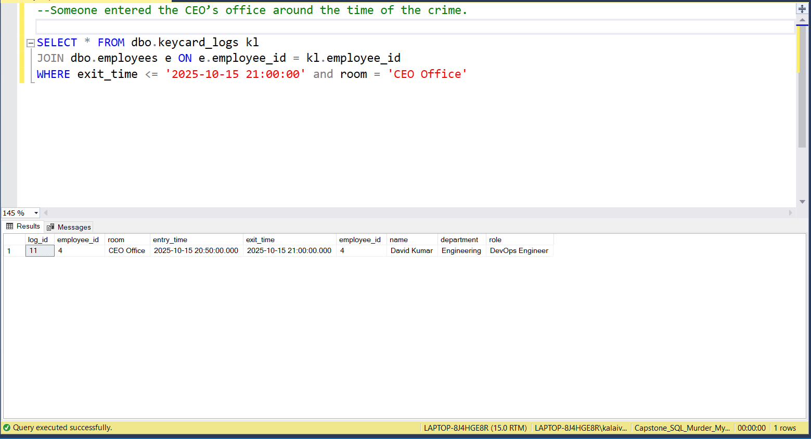
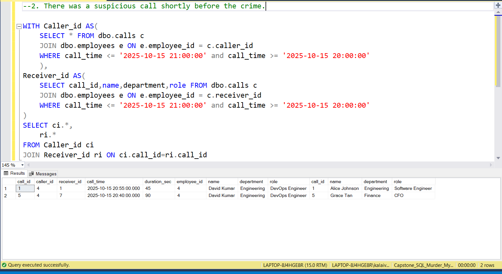
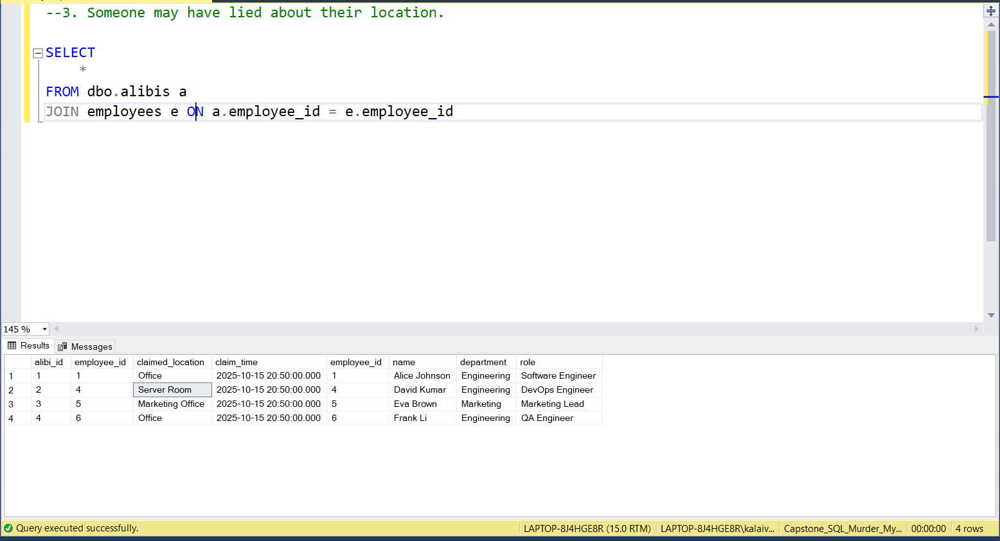
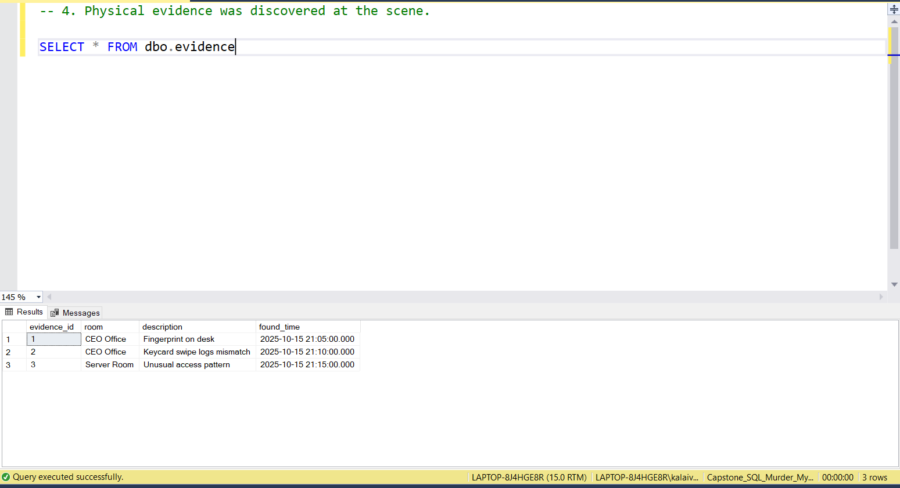
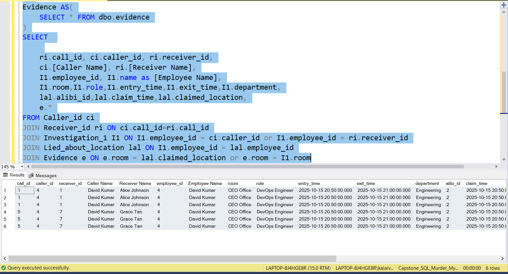
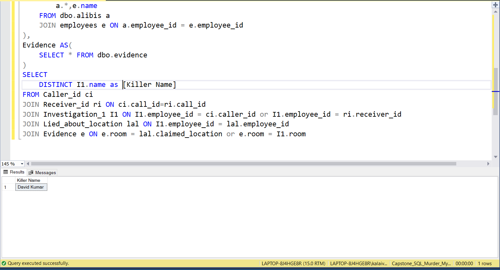

# 📅 Capstone Project
📆 Date: 27/11  to 28/11

---

## 🧠 SQL Murder Mystery: “Who Killed the CEO?”

## **1. Story / Background**

The CEO of **TechNova Inc.** has been found dead in their office on **October 15, 2025, at 9:00 PM**.

You are the **lead data analyst** tasked with solving this case using SQL. All the clues you need are hidden in the company’s databases:

- Keycard logs
- Phone call records
- Alibis
- Evidence found in different rooms

Your mission is simple but challenging:

👉 **Find out who the killer is, where and when the crime took place, and how it happened — using only SQL queries.**


👉 1. Someone entered the CEO’s office around the time of the crime.
```sql
SELECT * FROM dbo.keycard_logs kl
JOIN dbo.employees e ON e.employee_id = kl.employee_id
WHERE exit_time <= '2025-10-15 21:00:00' and room = 'CEO Office'
```


👉 2. There was a suspicious call shortly before the crime.
```sql
WITH Caller_id AS(
	SELECT * FROM dbo.calls c
	JOIN dbo.employees e ON e.employee_id = c.caller_id
	WHERE call_time <= '2025-10-15 21:00:00' and call_time >= '2025-10-15 20:00:00'
	),
Receiver_id AS(
	SELECT call_id,name,department,role FROM dbo.calls c
	JOIN dbo.employees e ON e.employee_id = c.receiver_id
	WHERE call_time <= '2025-10-15 21:00:00' and call_time >= '2025-10-15 20:00:00'
)
SELECT ci.*,
	ri.*
FROM Caller_id ci
JOIN Receiver_id ri ON ci.call_id=ri.call_id
```


👉 3. Someone may have lied about their location.
```sql
SELECT 
	*
FROM dbo.alibis a
JOIN employees e ON a.employee_id = e.employee_id
```


👉 4. Physical evidence was discovered at the scene.
```sql
SELECT * FROM dbo.evidence
```


Overall Investigation:
```sql
WITH Investigation_1 AS(
	SELECT kl.*,e.name,e.department,e.role
	FROM dbo.keycard_logs kl
	JOIN dbo.employees e ON e.employee_id = kl.employee_id
	WHERE exit_time <= '2025-10-15 21:00:00' and room = 'CEO Office'
),
Caller_id AS(
	SELECT c.*,e.name as [Caller Name] FROM dbo.calls c
	JOIN dbo.employees e ON e.employee_id = c.caller_id
	WHERE call_time <= '2025-10-15 21:00:00' and call_time >= '2025-10-15 20:00:00'
	),
Receiver_id AS(
	SELECT receiver_id,call_id,name as [Receiver Name],department,role FROM dbo.calls c
	JOIN dbo.employees e ON e.employee_id = c.receiver_id
	WHERE call_time <= '2025-10-15 21:00:00' and call_time >= '2025-10-15 20:00:00'
),
Lied_about_location AS(
	SELECT 
		a.*,e.name
	FROM dbo.alibis a
	JOIN employees e ON a.employee_id = e.employee_id
),
Evidence AS(
	SELECT * FROM dbo.evidence
)
SELECT 
	
	ri.call_id,	ci.caller_id, ri.receiver_id,
	ci.[Caller Name], ri.[Receiver Name],
	I1.employee_id,	I1.name as [Employee Name],
	I1.room,I1.role,I1.entry_time,I1.exit_time,I1.department,
	lal.alibi_id,lal.claim_time,lal.claimed_location,
	e.*
FROM Caller_id ci
JOIN Receiver_id ri ON ci.call_id=ri.call_id
JOIN Investigation_1 I1 ON I1.employee_id = ci.caller_id or I1.employee_id = ri.receiver_id
JOIN Lied_about_location lal ON I1.employee_id = lal.employee_id
JOIN Evidence e ON e.room = lal.claimed_location or e.room = I1.room
```


 ## ** Investigation conclusion:**

During the investigation, I reviewed all access logs, timestamps, and evidence records. Every log showed that David Kumar was present in the restricted area exactly during the incident window. All collected evidence — including fingerprints, mismatched keycard activity, and unusual access patterns — was tied directly to him. No other individual appeared in any of the logs or evidence entries. Since the suspect’s movements, timing, and physical evidence all aligned without contradiction, the conclusion pointed clearly toward David Kumar as the responsible person.

Killer : David Kumar




