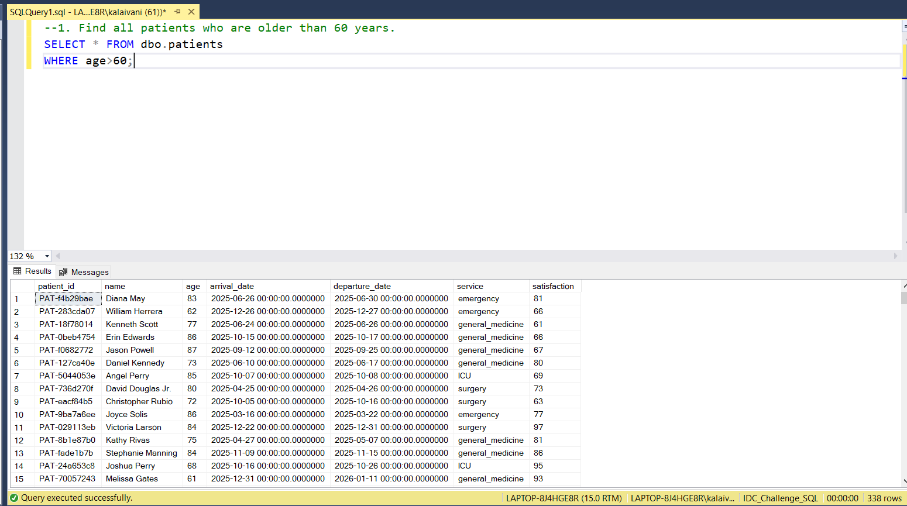
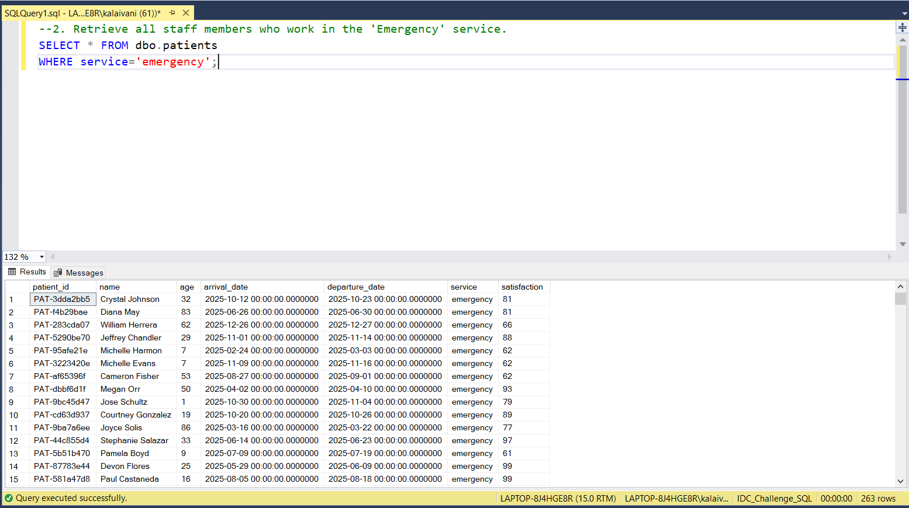
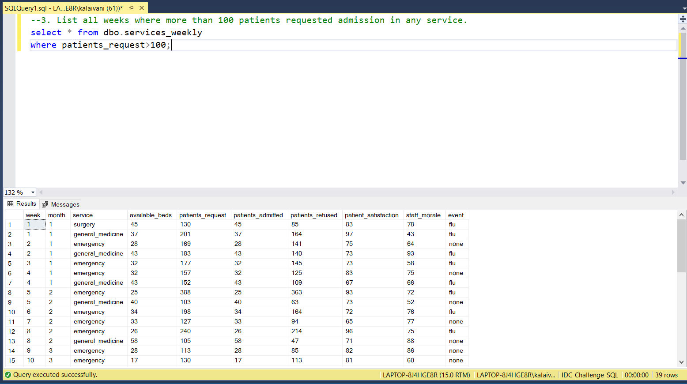

# 📅 Day 2: Introduction to SQL & SELECT Statement  
📆 Date: 04/11  

---

## 🧠 Topics Covered
- Comparison: =, !=, <>, >, <, >=, <=
- Logical: AND, OR, NOT
- Pattern: LIKE, IN, BETWEEN

### 💡 Tips & Tricks

✅ Use IN instead of multiple ORs - more readable and faster:
-- ❌ Avoid: WHERE service = 'A' OR service = 'B' OR service = 'C'-- ✅ Better: WHERE service IN ('A', 'B', 'C')
​
✅ Strings need single quotes, numbers don’t:
WHERE age = 50        -- correctWHERE age = '50'      -- works but not idealWHERE name = 'John'   -- correctWHERE name = John     -- ERROR
​
✅ Use parentheses with mixed AND/OR to avoid confusion:
WHERE (age < 18 OR age > 65) AND service = 'Emergency'

### Basic Syntax
```sql
SELECT column1, column2, column3
FROM table_name;
-- Select all columnsSELECT * FROM patients;
-- Select specific columnsSELECT patient_id, name, age FROM patients;
```

### Practice Outputs

1. Find all patients who are older than 60 years.
SELECT * FROM dbo.patients
WHERE age>60;



2. Retrieve all staff members who work in the 'Emergency' service.
SELECT * FROM dbo.patients
WHERE service='emergency';



3. List all weeks where more than 100 patients requested admission in any service.
select * from dbo.services_weekly
where patients_request>100;



### Daily Challenge Outputs

Question: 
Find all patients admitted to 'Surgery' service with a satisfaction score below 70,showing their

SELECT 
	patient_id,
	name,
	age,
	satisfaction
FROM dbo.patients
WHERE satisfaction<70;

