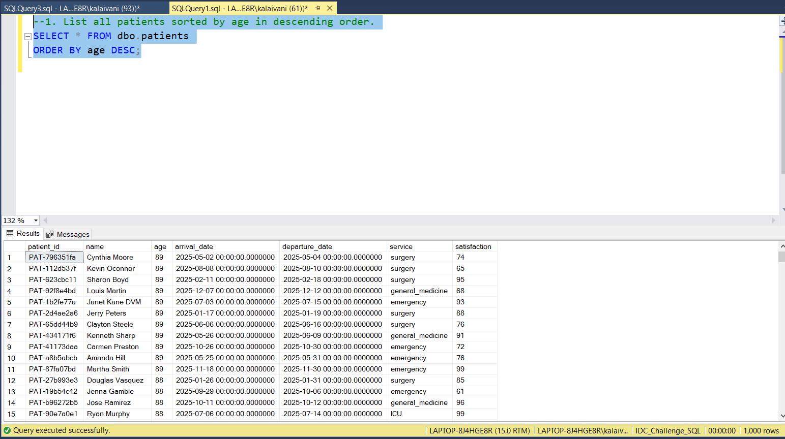
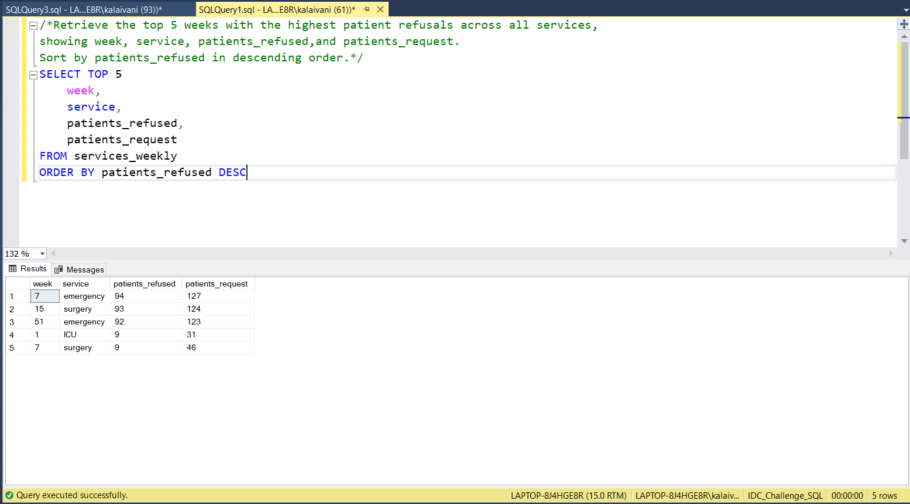

# 📅 Day 3: Sorting Data with ORDER BY 
📆 Date: 05/11  

---

## 🧠 Topics Covered
- ORDER BY
- ASC/DESC
- multiple column sorting

### 💡 Tips & Tricks

✅ Multi-column sorting order matters:
ORDER BY service, age    -- First by service, then age within each serviceORDER BY age, service
​
✅ You can order by columns not in SELECT:
SELECT name, age FROM patients ORDER BY satisfaction DESC;
​
✅ Use DESC for “Top N” queries:
SELECT * FROM patients
ORDER BY satisfaction DESC
LIMIT 10;  -- Top 10 most satisfied patients

### Basic Syntax
```sql
SELECT column1, column2
FROM table_name
ORDER BY column1 [ASC|DESC];
```

### Practice Outputs

1. List all patients sorted by age in descending order.
SELECT * FROM dbo.patients
ORDER BY age DESC;



2. Show all services_weekly data sorted by week number ascending and patients_request descending.
SELECT * FROM dbo.services_weekly
ORDER BY week ASC,patients_request DESC


3. Display staff members sorted alphabetically by their names.
SELECT * FROM dbo.staff
ORDER BY staff_name


### Daily Challenge Outputs

Question: 
Retrieve the top 5 weeks with the highest patient refusals across all services, showing week, service, patients_refused, and patients_request. Sort by patients_refused in descending order.

SELECT TOP 5 
	week,
	service,
	patients_refused,
	patients_request
FROM services_weekly
ORDER BY patients_refused DESC

