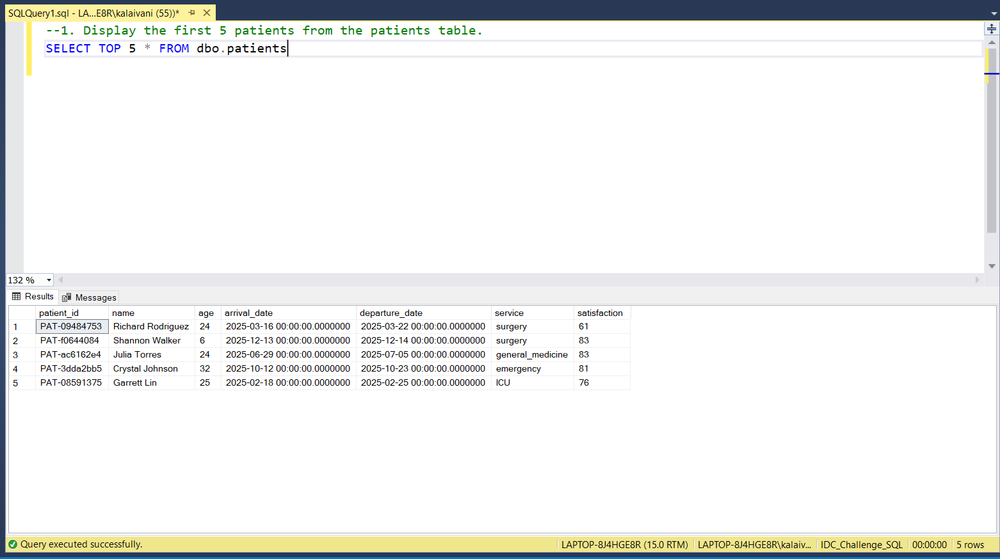
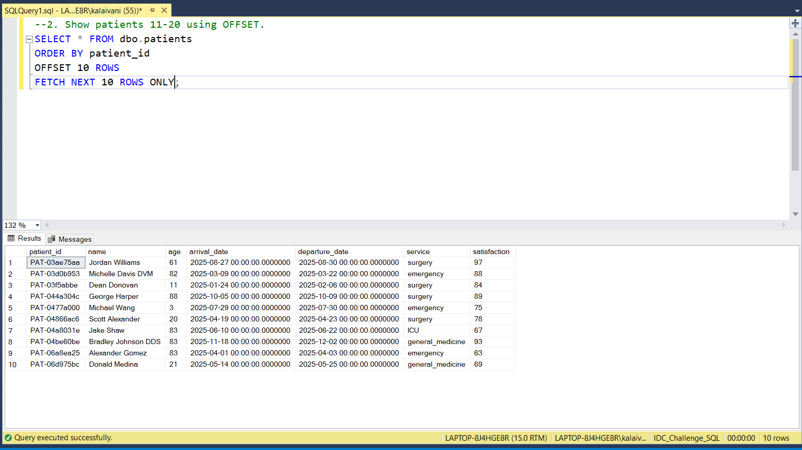
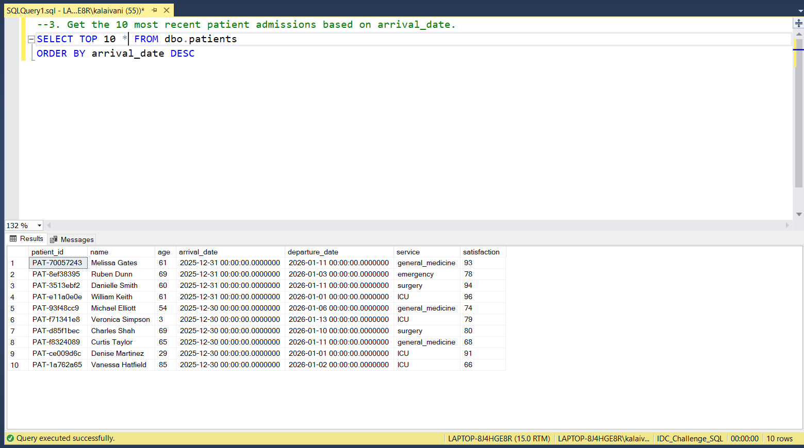
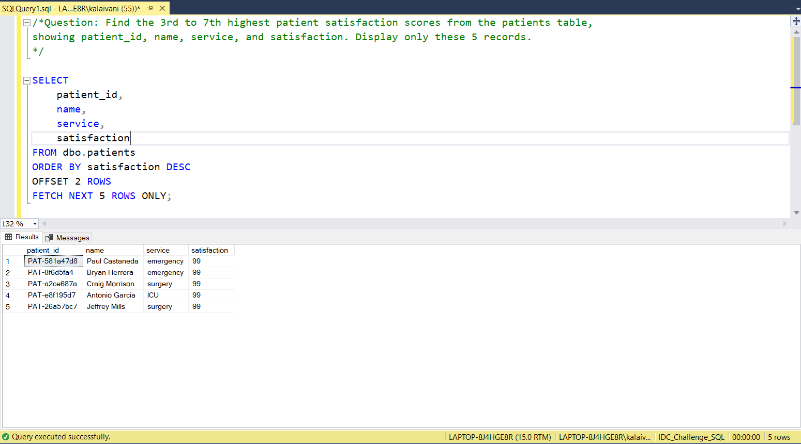

# 📅 Day 4: LIMIT and OFFSET 
📆 Date: 06/11  

---

## 🧠 Topics Covered
- LIMIT
- OFFSET
- Pagination concepts

### 💡 Tips & Tricks

✅ **Pagination formula**: `OFFSET = (page_number - 1) × page_size`

✅ **Combine with ORDER BY** for consistent results:

```sql
-- ❌ Unpredictable: LIMIT without ORDER BY-- ✅ Predictable: Always use ORDER BY with LIMITSELECT * FROM patients
ORDER BY patient_id
LIMIT 10 OFFSET 20;
```

✅ **Test queries with LIMIT** before running on full dataset

✅ **Database-specific syntax**:
- MySQL/PostgreSQL/SQLite: `LIMIT` and `OFFSET`
- SQL Server: `TOP` or `OFFSET...FETCH`
- Oracle: `ROWNUM` or `FETCH FIRST`

✅ **LIMIT is applied last**: FROM → WHERE → GROUP BY → HAVING → SELECT → ORDER BY → **LIMIT**

### Basic Syntax
```sql
SELECT column_list
FROM table_name
ORDER BY column_name
OFFSET offset_rows ROWS
FETCH NEXT fetch_rows ROWS ONLY;

/*Pagination Example:
Page 1: First 10 recordsSELECT * FROM patients LIMIT 10 OFFSET 0;
Page 2: Next 10 recordsSELECT * FROM patients LIMIT 10 OFFSET 10;
Page 3: Next 10 recordsSELECT * FROM patients LIMIT 10 OFFSET 20;*/

```

### Practice Outputs

1. Display the first 5 patients from the patients table.
SELECT TOP 5 * FROM dbo.patients



2. Show patients 11-20 using OFFSET.
SELECT * FROM dbo.patients
ORDER BY patient_id
OFFSET 10 ROWS
FETCH NEXT 10 ROWS ONLY;



3. Get the 10 most recent patient admissions based on arrival_date.
SELECT TOP 10 * FROM dbo.patients
ORDER BY arrival_date DESC



### Daily Challenge Outputs

Question: 
Find the 3rd to 7th highest patient satisfaction scores from the patients table,
showing patient_id, name, service, and satisfaction. Display only these 5 records.

SELECT
	patient_id,
	name,
	service,
	satisfaction
FROM dbo.patients
ORDER BY satisfaction DESC
OFFSET 2 ROWS
FETCH NEXT 5 ROWS ONLY;

