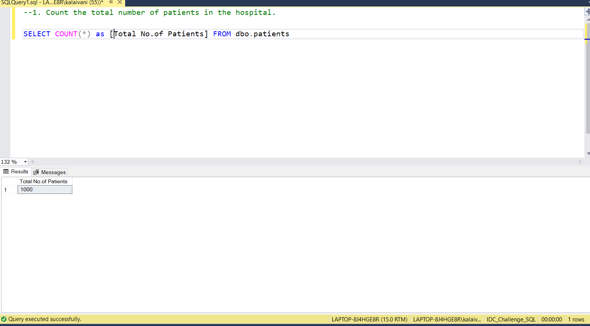
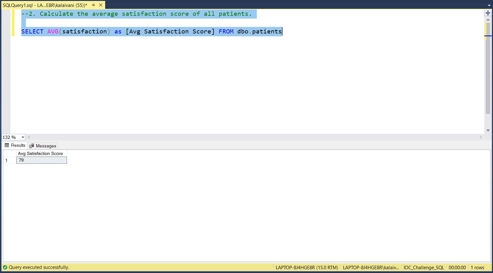
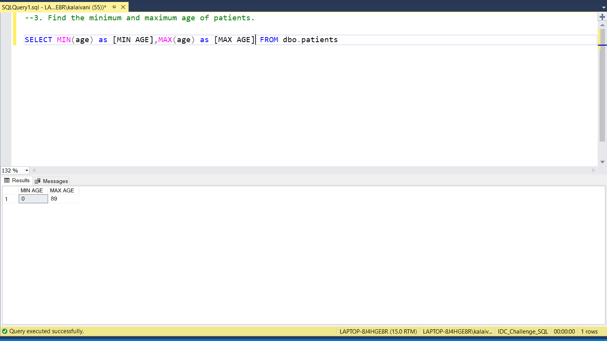
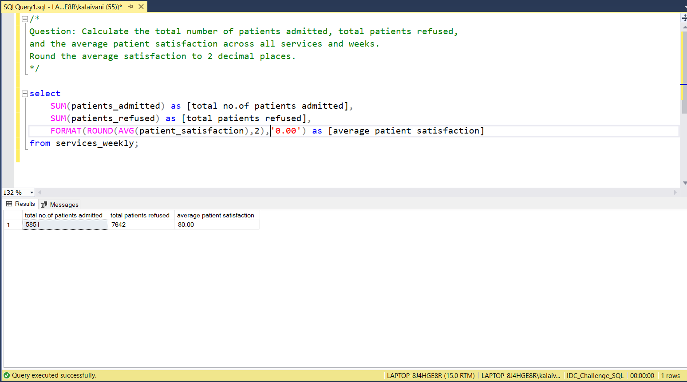

# 📅 Day 5: LIMIT and OFFSET 
📆 Date: 07/11  

---

## 🧠 Topics Covered
Functions:
- COUNT
- SUM
- AVG
- MIN
- MAX

### 💡 Tips & Tricks

✅ **COUNT(*) vs COUNT(column)**:
- `COUNT(*)` counts all rows (including NULLs)
- `COUNT(column)` counts only non-NULL values

✅ **Round averages** for cleaner output:

```sql
SELECT ROUND(AVG(age), 2) AS avg_age FROM patients;
```

✅ **Aggregates ignore NULL** (except COUNT(*))

✅ **Use DISTINCT with COUNT** to count unique values:

```sql
SELECT COUNT(DISTINCT service) AS unique_services FROM patients;
```

✅ **Alias your aggregates** for readable column names.

### Basic Syntax

The Five Core Aggregates:
COUNT(*)           -- Counts all rowsCOUNT(column)      -- Counts non-NULL valuesCOUNT(DISTINCT c)  -- Counts unique non-NULL valuesSUM(column)        -- Adds numeric valuesAVG(column)        -- Calculates averageMIN(column)        -- Finds minimum valueMAX(column)        -- Finds maximum value

### Practice Outputs

1. Count the total number of patients in the hospital.
SELECT COUNT(*) as [Total No.of Patients] FROM dbo.patients



2. Calculate the average satisfaction score of all patients.
SELECT AVG(satisfaction) as [Avg Satisfaction Score] FROM dbo.patients



3. Find the minimum and maximum age of patients.
SELECT MIN(age) as [MIN AGE],MAX(age) as [MAX AGE] FROM dbo.patients



### Daily Challenge Outputs

Question: Calculate the total number of patients admitted, total patients refused,
and the average patient satisfaction across all services and weeks.
Round the average satisfaction to 2 decimal places.

select 
	SUM(patients_admitted) as [total no.of patients admitted],
	SUM(patients_refused) as [total patients refused],
	FORMAT(ROUND(AVG(patient_satisfaction),2),'0.00') as [average patient satisfaction]
from services_weekly;

