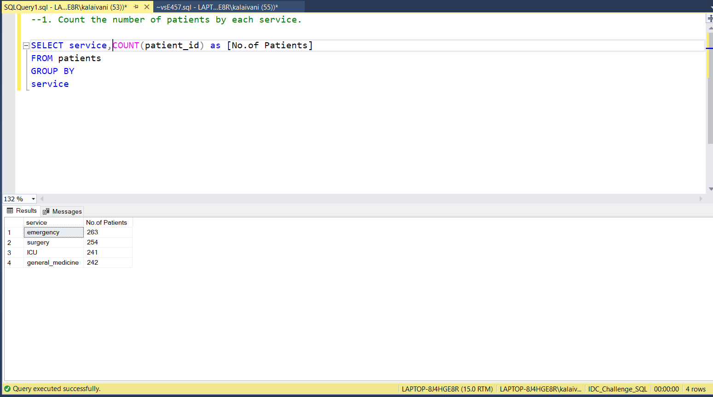
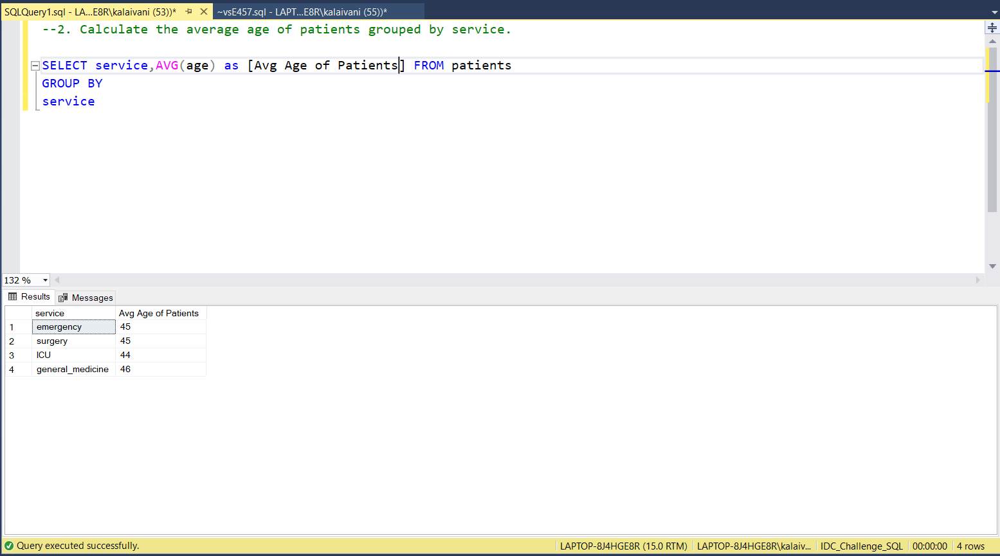
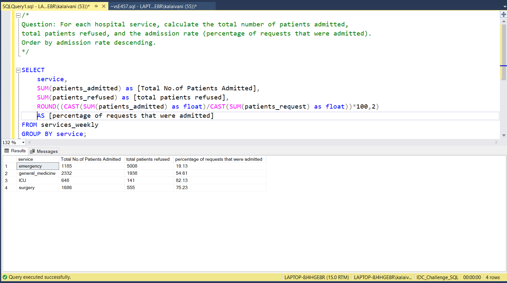

# 📅 Day 6: Group By Clause 
📆 Date: 09/11  

---

## 🧠 Topics Covered
- Every non-aggregated column in SELECT must be in GROUP BY
- Each group produces one result row
- Use aggregates (COUNT, SUM, AVG, etc.) on other columns

### 💡 Tips & Tricks

✅ **Think “one row per group”** - if you GROUP BY service, you get one row per service

✅ **Execution order**: FROM → WHERE → **GROUP BY** → SELECT → ORDER BY → LIMIT

✅ **Use WHERE before GROUP BY** to filter rows, HAVING after GROUP BY to filter groups

✅ **Group by multiple columns** for finer granularity:

```sql
GROUP BY service, month  -- One row per service-month combination
```

✅ **You can ORDER BY aggregates**:

```sql
SELECT service, COUNT(*) AS countFROM patients
GROUP BY service
ORDER BY count DESC;  -- Order by the aggregated count
```

✅ **Name your aggregates** to reference them in ORDER BY more clearly

### Basic Syntax

SELECT column1, aggregate_function(column2)
FROM table_name
GROUP BY column1;

### Practice Outputs

1. Count the number of patients by each service.
SELECT service,COUNT(patient_id) as [No.of Patients] FROM patients
GROUP BY
service



2. Calculate the average age of patients grouped by service.
SELECT service,AVG(age) as [Avg Age of Patients] FROM patients
GROUP BY
service



3. Find the total number of staff members per role.
SELECT role,COUNT(*) FROM staff
GROUP BY role


### Daily Challenge Outputs

Question: For each hospital service, calculate the total number of patients admitted,
total patients refused, and the admission rate (percentage of requests that were admitted).
Order by admission rate descending.

SELECT 
    service,
	SUM(patients_admitted) as [Total No.of Patients Admitted],
	SUM(patients_refused) as [total patients refused],
    ROUND((CAST(SUM(patients_admitted) as float)/CAST(SUM(patients_request) as float))*100,2) 
	AS [percentage of requests that were admitted]
FROM services_weekly
GROUP BY service;

