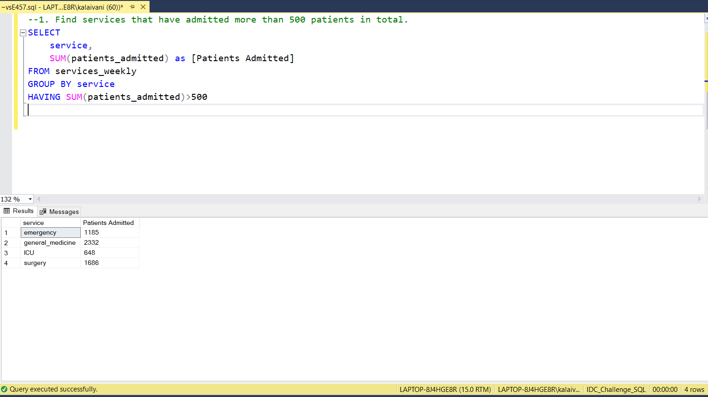
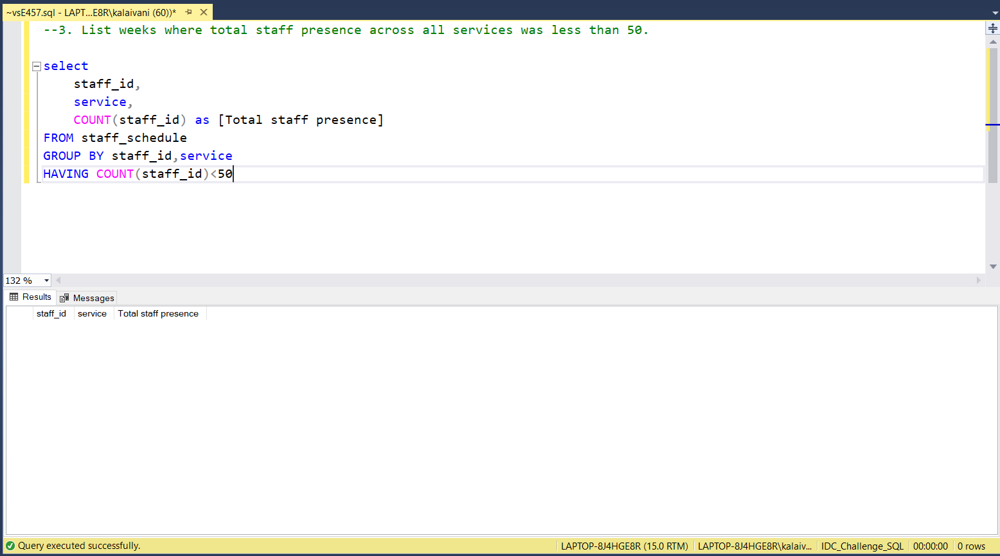
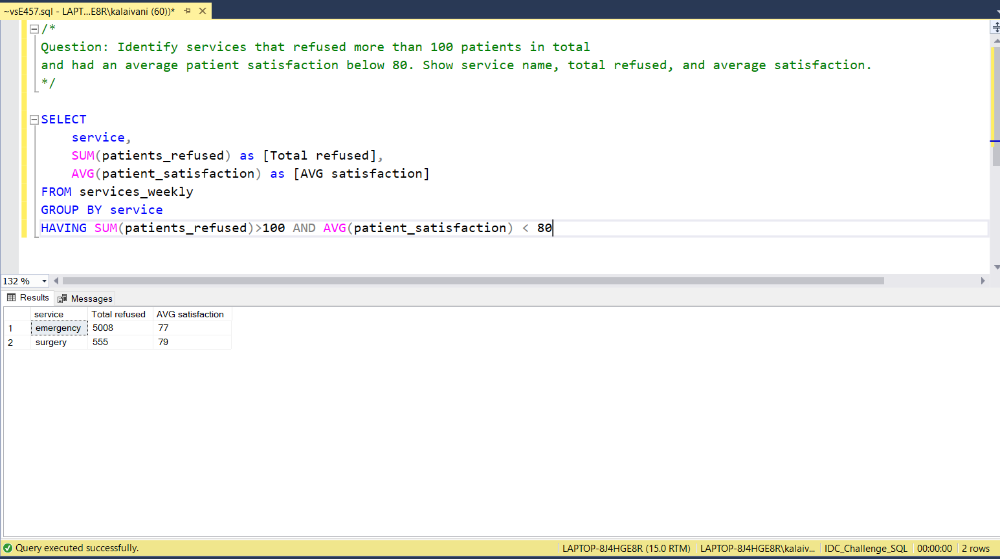

# 📅 Day 7: HAVING Clause
📆 Date: 10/11  

---

## 🧠 Topics Covered
- HAVING filters groups created by GROUP BY, similar to how WHERE filters rows.

### 💡 Tips & Tricks

✅ Execution order: WHERE → GROUP BY → HAVING → ORDER BY
✅ Use WHERE for row filtering, HAVING for group filtering:

```sql
-- ❌ Inefficient: HAVING age > 65-- ✅ Efficient: WHERE age > 65SELECT service, COUNT(*) FROM patients
WHERE age > 65        -- Filter before grouping (faster)GROUP BY service;
```
​
✅ HAVING requires GROUP BY - you can’t use HAVING without grouping
✅ You can reference column aliases in HAVING (database-dependent):

```sql
SELECT service, COUNT(*) AS countFROM patients
GROUP BY service
HAVING count > 100;  -- Some databases allow this
```
WHERE vs HAVING:
- WHERE: Filters rows before grouping
- HAVING: Filters groups after grouping
- WHERE: Cannot use aggregate functions
- HAVING: Can use aggregate functions

### Basic Syntax

SELECT column1, aggregate_function(column2)
FROM table_name
GROUP BY column1
HAVING aggregate_condition;

### Practice Outputs

1. Find services that have admitted more than 500 patients in total.
SELECT 
	service,
	SUM(patients_admitted) as [Patients Admitted]
FROM services_weekly
GROUP BY service
HAVING SUM(patients_admitted)>500



2. Show services where average patient satisfaction is below 75.
SELECT 
	service,
	AVG(patient_satisfaction) as [AVG patient satisfaction]
FROM services_weekly
GROUP BY service
HAVING AVG(patient_satisfaction)<75


3. List weeks where total staff presence across all services was less than 50.
select 
	staff_id,
	service,
	COUNT(staff_id) as [Total staff presence]
FROM staff_schedule
GROUP BY staff_id,service
HAVING COUNT(staff_id)<50



### Daily Challenge Outputs

Question: Identify services that refused more than 100 patients in total
and had an average patient satisfaction below 80. Show service name, total refused, and average satisfaction.

SELECT 
	service,
	SUM(patients_refused) as [Total refused],
	AVG(patient_satisfaction) as [AVG satisfaction]
FROM services_weekly
GROUP BY service
HAVING SUM(patients_refused)>100 AND AVG(patient_satisfaction) < 80


