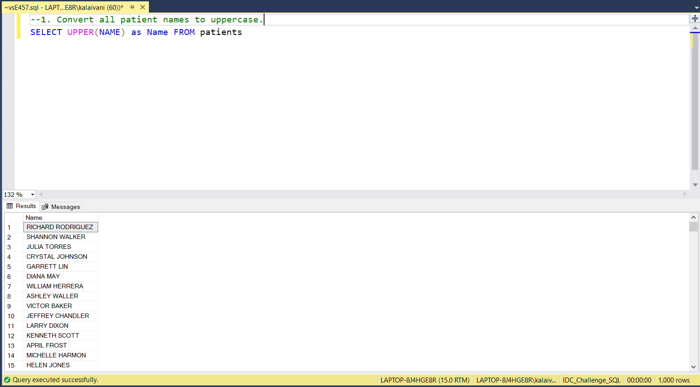
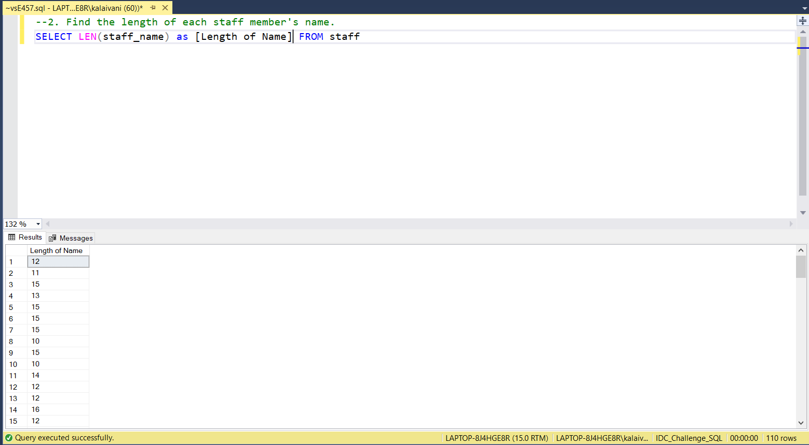
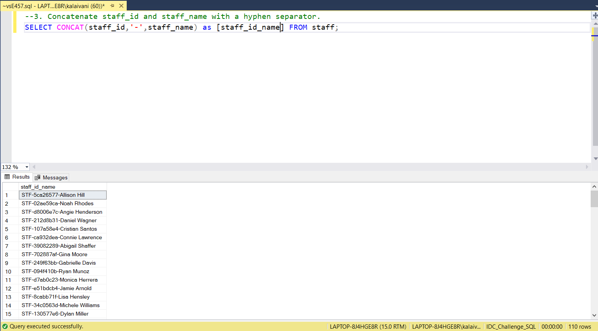
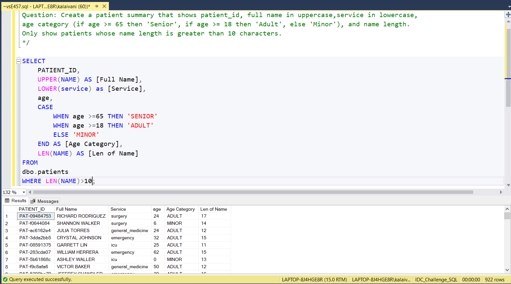

# 📅 Day 8: String Functions
📆 Date: 11/11  

---

## 🧠 Topics Covered
- String functions manipulate text data in your queries.
- CONCAT combined two text

Common String Functions:
```sql
UPPER(column)           -- Convert to uppercaseLOWER(column)           -- Convert to lowercaseLENGTH(column)          -- Get string lengthCONCAT(str1, str2)      -- Combine stringsSUBSTRING(str, pos, len) -- Extract substringTRIM(column)            -- Remove leading/trailing spacesREPLACE(str, old, new)  -- Replace text
```

### 💡 Tips & Tricks

✅ Use || or CONCAT for string concatenation (database-dependent):
```sql
-- SQLite/PostgreSQL: name || ' - ' || service-- MySQL: CONCAT(name, ' - ', service)
```
​
✅ TRIM variants: LTRIM() (left), RTRIM() (right), TRIM() (both sides)
✅ Case-insensitive comparison:
```sql
WHERE LOWER(name) = LOWER('john smith')  -- Matches any case
```
​
✅ String functions are great in SELECT but avoid them in WHERE for better performance (they prevent index usage)
✅ Combine with CASE for complex logic:
```sql
SELECT
    name,
    CASE
        WHEN LENGTH(name) > 20 THEN SUBSTRING(name, 1, 20) || '...'        ELSE name
    END AS display_name
FROM patients;
```

### Basic Syntax

-- Convert to uppercaseSELECT UPPER(name) AS name_upper FROM patients;
-- Concatenate columnsSELECT CONCAT(name, ' - ', service) AS patient_info FROM patients;
-- Get name lengthSELECT name, LENGTH(name) AS name_length
FROM patients
WHERE LENGTH(name) > 15;
-- Extract substring (first 3 characters)SELECT SUBSTRING(name, 1, 3) AS name_abbr FROM patients;
-- Replace textSELECT REPLACE(service, 'Emergency', 'ER') AS service_abbr
FROM patients;

### Practice Outputs

1. Convert all patient names to uppercase.
SELECT UPPER(NAME) as Name FROM patients



2. Find the length of each staff member's name.
SELECT LEN(staff_name) as [Length of Name] FROM staff



3. Concatenate staff_id and staff_name with a hyphen separator.
SELECT CONCAT(staff_id,'-',staff_name) as [staff_id_name] FROM staff;



### Daily Challenge Outputs

Question: Create a patient summary that shows patient_id, full name in uppercase,service in lowercase,
age category (if age >= 65 then 'Senior', if age >= 18 then 'Adult', else 'Minor'), and name length.
Only show patients whose name length is greater than 10 characters.

SELECT
	PATIENT_ID,
	UPPER(NAME) AS [Full Name],
	LOWER(service) as [Service],
	age,
	CASE
		WHEN age >=65 THEN 'SENIOR'
		WHEN age >=18 THEN 'ADULT'
		ELSE 'MINOR'
	END AS [Age Category],
	LEN(NAME) AS [Len of Name] 
FROM
dbo.patients
WHERE LEN(NAME)>10;


