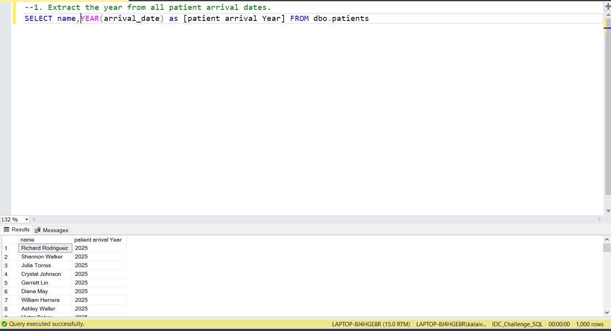
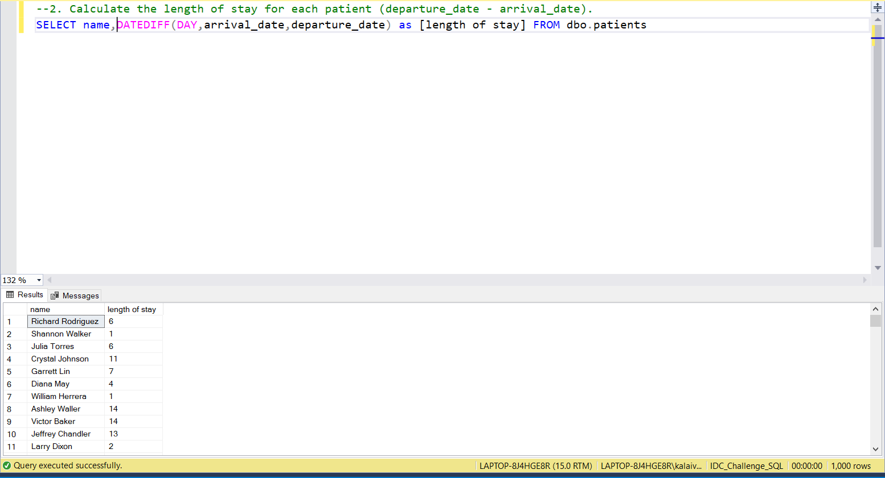
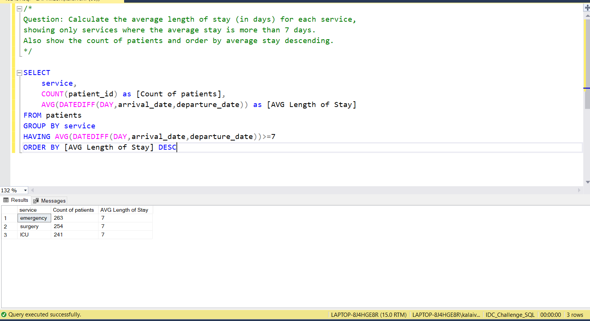

# 📅 Day 9: Date Functions
📆 Date: 12/11  

---

## 🧠 Topics Covered
- DATE functions
- date arithmetic
- EXTRACT

### 💡 Tips & Tricks

✅ **Date format matters**: Use ISO format ‘YYYY-MM-DD’ for consistency

✅ **Calculate date differences** using database-specific functions:

```sql
-- SQLite: JULIANDAY(date2) - JULIANDAY(date1)-- MySQL: DATEDIFF(date2, date1)-- PostgreSQL: date2 - date1
```

✅ **Extract parts with strftime** (SQLite):

```sql
strftime('%Y', date)  -- Year (2024)strftime('%m', date)  -- Month (01-12)strftime('%d', date)  -- Day (01-31)strftime('%W', date)  -- Week number
```

✅ **Use date functions in WHERE** carefully - they can slow queries on large tables

✅ **Always cast date calculations** to appropriate types (INTEGER, REAL) for consistency

### Basic Syntax

```sql
-- SQLite examples (syntax varies by database)DATE('now')                    -- Current dateJULIANDAY(date)               -- Convert to Julian day numberDATE(date, '+1 day')          -- Add 1 daystrftime('%Y', date)          -- Extract yearstrftime('%m', date)          -- Extract monthstrftime('%d', date)          -- Extract day
```

### Practice Outputs

1. Extract the year from all patient arrival dates.
SELECT name,YEAR(arrival_date) as [patient arrival Year] FROM dbo.patients



2. Calculate the length of stay for each patient (departure_date - arrival_date).
SELECT name,DATEDIFF(DAY,arrival_date,departure_date) as [length of stay] FROM dbo.patients



3. Find all patients who arrived in a specific month.
SELECT name,DATENAME(MONTH,arrival_date) as [Month Name] FROM dbo.patients


### Daily Challenge Outputs

Question: Calculate the average length of stay (in days) for each service,
showing only services where the average stay is more than 7 days.
Also show the count of patients and order by average stay descending.

SELECT 
	service,
	COUNT(patient_id) as [Count of patients],
	AVG(DATEDIFF(DAY,arrival_date,departure_date)) as [AVG Length of Stay]
FROM patients
GROUP BY service
HAVING AVG(DATEDIFF(DAY,arrival_date,departure_date))>=7
ORDER BY [AVG Length of Stay] DESC


