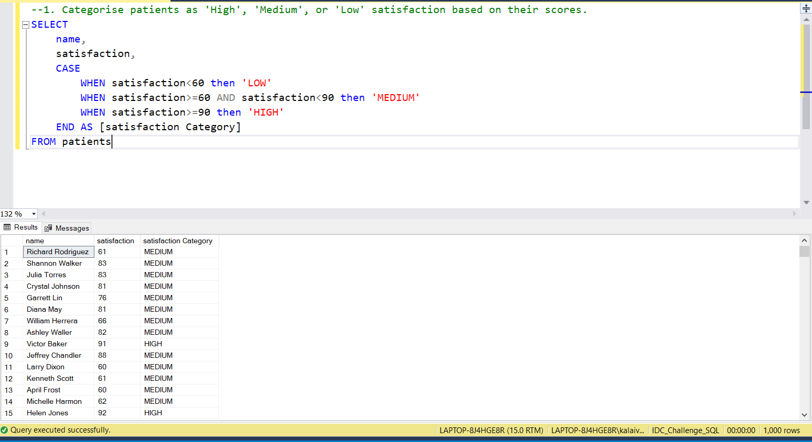
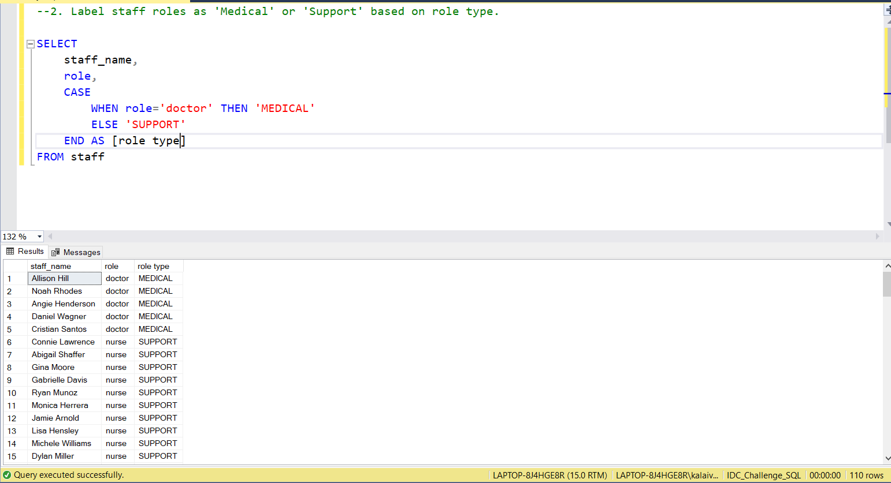
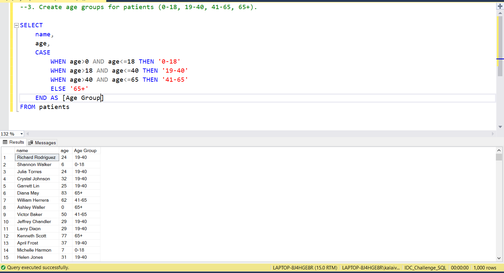
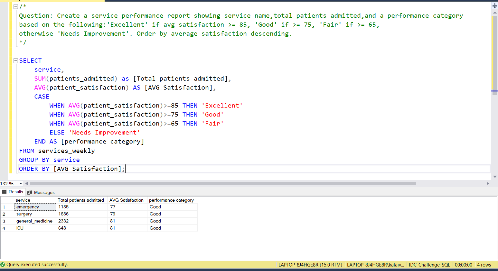

# 📅 Day 10: CASE Statements
📆 Date: 13/11  

---

## 🧠 Topics Covered
- CASE WHEN
- conditional logic
- derived columns

### 💡 Tips & Tricks

✅ **Always include ELSE** to handle unexpected values (otherwise returns NULL)

✅ **CASE is an expression, not a statement** - use it anywhere you’d use a column

✅ **Use CASE in ORDER BY** for custom sorting:

```sql
ORDER BY CASE
    WHEN service = 'Emergency' THEN 1    WHEN service = 'ICU' THEN 2    ELSE 3END
```

✅ **Conditional aggregation pattern**:

```sql
SUM(CASE WHEN condition THEN 1 ELSE 0 END)  -- Count matching rowsAVG(CASE WHEN condition THEN value ELSE NULL END)  -- Conditional average
```

✅ **Nest CASE statements** for complex logic (but consider readability)

✅ **CASE evaluates top-to-bottom** - first match wins, so order matters!

### Basic Syntax

```sql
-- Simple CASECASE column_name
    WHEN value1 THEN result1
    WHEN value2 THEN result2
    ELSE default_result
END-- Searched CASE (more flexible)CASE    WHEN condition1 THEN result1
    WHEN condition2 THEN result2
    ELSE default_result
END
```

### Practice Outputs

1. Categorise patients as 'High', 'Medium', or 'Low' satisfaction based on their scores.
SELECT
	name,
	satisfaction,
	CASE 
		WHEN satisfaction<60 then 'LOW'
		WHEN satisfaction>=60 AND satisfaction<90 then 'MEDIUM'
		WHEN satisfaction>=90 then 'HIGH'
	END AS [satisfaction Category]
FROM patients



2. Label staff roles as 'Medical' or 'Support' based on role type.
SELECT 
	staff_name,
	role,
	CASE
		WHEN role='doctor' THEN 'MEDICAL'
		ELSE 'SUPPORT'
	END AS [role type]
FROM staff



3. Create age groups for patients (0-18, 19-40, 41-65, 65+).

SELECT 
	name,
	age,
	CASE
		WHEN age>0 AND age<=18 THEN '0-18'
		WHEN age>18 AND age<=40 THEN '19-40'
		WHEN age>40 AND age<=65 THEN '41-65'
		ELSE '65+'
	END AS [Age Group]
FROM patients



### Daily Challenge Outputs

Question: Create a service performance report showing service name,total patients admitted,and a performance category
based on the following:'Excellent' if avg satisfaction >= 85, 'Good' if >= 75, 'Fair' if >= 65,
otherwise 'Needs Improvement'. Order by average satisfaction descending.
SELECT 
	service,
	SUM(patients_admitted) as [Total patients admitted],
	AVG(patient_satisfaction) AS [AVG Satisfaction],
	CASE
		WHEN AVG(patient_satisfaction)>=85 THEN 'Excellent'
		WHEN AVG(patient_satisfaction)>=75 THEN 'Good'
		WHEN AVG(patient_satisfaction)>=65 THEN 'Fair'
		ELSE 'Needs Improvement'
	END AS [performance category]
FROM services_weekly
GROUP BY service
ORDER BY [AVG Satisfaction];

