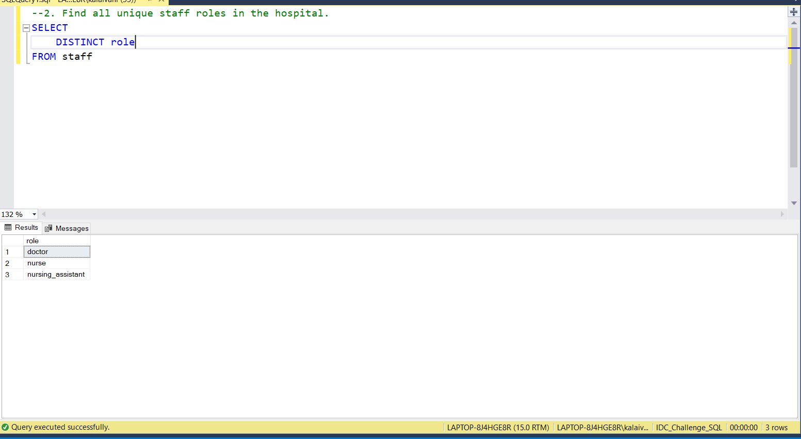
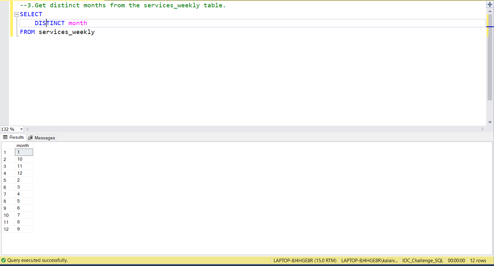
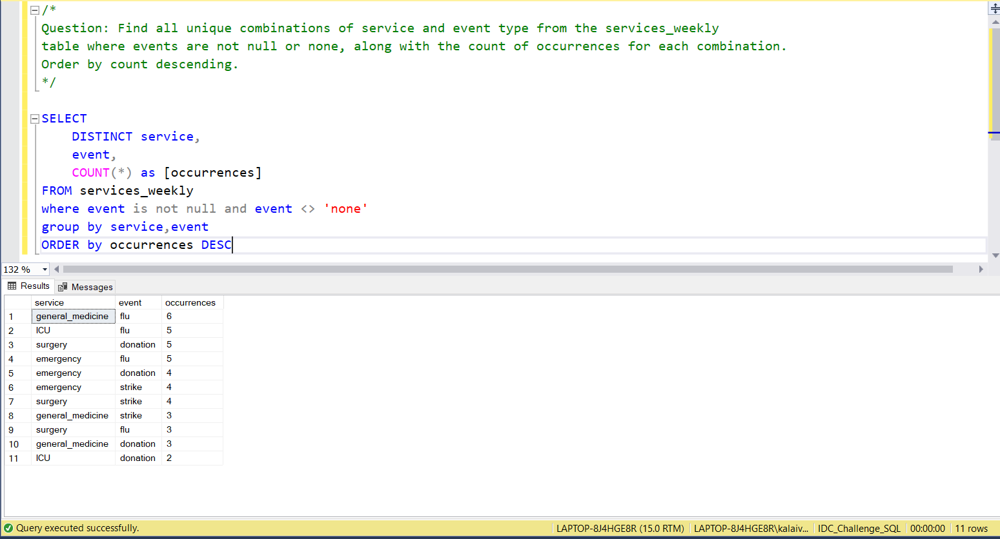

# 📅 Day 11: DISTINCT and Handling Duplicates
📆 Date: 14/11  

---

## 🧠 Topics Covered
- DISTINCT
- removing duplicates
- unique values

### 💡 Tips & Tricks

✅ **DISTINCT vs GROUP BY**:

```sql
-- These are similar:SELECT DISTINCT service FROM patients;
SELECT service FROM patients GROUP BY service;
-- Use DISTINCT for simple unique values, GROUP BY when you need aggregates
```

✅ **DISTINCT applies to entire row**, not individual columns:

```sql
-- This returns unique combinations of (service, name)SELECT DISTINCT service, name FROM patients;
```

✅ **Use COUNT(DISTINCT column)** to count unique values within groups

✅ **DISTINCT can be expensive** - consider if you really need it or if GROUP BY would work better

✅ **DISTINCT with NULL**: NULL values are considered equal, so only one NULL appears

✅ **Remove duplicates before processing** when possible for better performance

### Basic Syntax

```sql
SELECT DISTINCT column1, column2
FROM table_name;
```

### Practice Outputs

1. List all unique services in the patients table.
SELECT 
	DISTINCT service
FROM patients


2. Find all unique staff roles in the hospital.
SELECT 
	DISTINCT role
FROM staff



3. Get distinct months from the services_weekly table.
SELECT 
	DISTINCT month
FROM services_weekly



### Daily Challenge Outputs

/*Question: Find all unique combinations of service and event type from the services_weekly 
table where events are not null or none, along with the count of occurrences for each combination.
Order by count descending.*/

SELECT 
	DISTINCT service,
	event,
	COUNT(*) as [occurrences]
FROM services_weekly
where event is not null and event <> 'none'
group by service,event
ORDER by occurrences DESC

