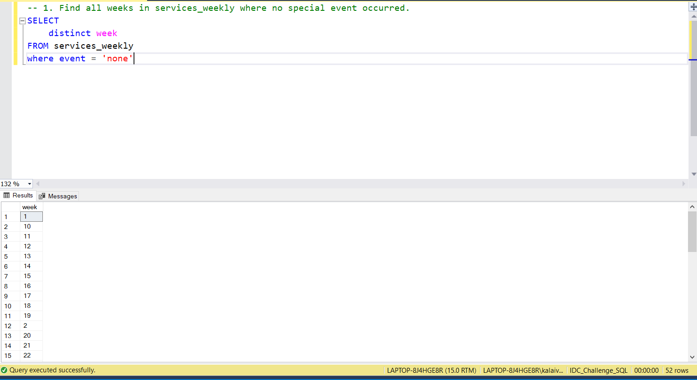
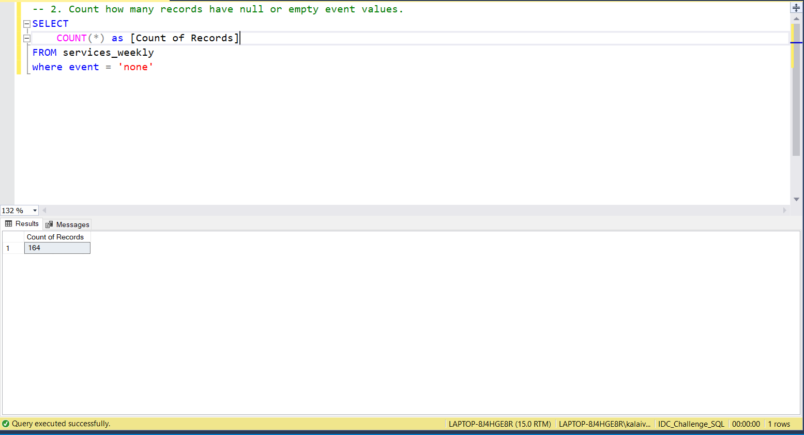
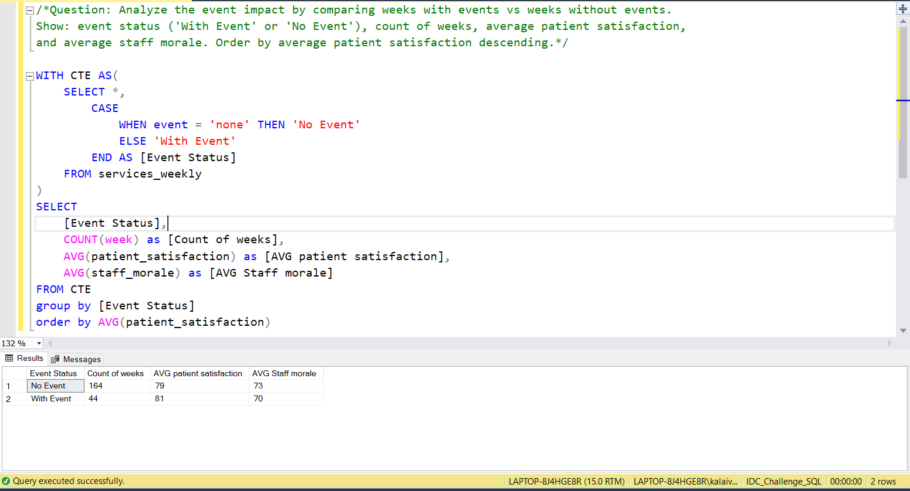

# 📅 Day 12: NULL Values and IS NULL/IS NOT NULL
📆 Date: 15/11  

---

## 🧠 Topics Covered
- NULL handling
- IS NULL
- IS NOT NULL
- COALESCE

### 💡 Tips & Tricks

✅ **Never use = or != with NULL**:

```sql
-- ❌ Wrong: WHERE event = NULL-- ❌ Wrong: WHERE event != NULL-- ✅ Correct: WHERE event IS NULL-- ✅ Correct: WHERE event IS NOT NULL
```

✅ **NULL in arithmetic** makes the entire result NULL:

```sql
-- If any value is NULL, result is NULL5 + NULL = NULLNULL * 10 = NULL
```

✅ **COALESCE accepts multiple arguments** and returns first non-NULL:

```sql
COALESCE(column1, column2, 'default')  -- Returns first non-NULL value
```

✅ **COUNT(*) includes NULLs, COUNT(column) excludes NULLs**

✅ **Handle NULL in ORDER BY**:

```sql
-- Put NULLs lastORDER BY COALESCE(event, 'ZZZZ')  -- Trick to sort NULLs to end
```

✅ **Empty string (’’) is NOT NULL** - they’re different! Always check both if needed]

### Basic Syntax

```sql
-- Check for NULLIS NULLIS NOT NULL-- Replace NULL with default valueCOALESCE(column, default_value)
-- NULL-safe comparison (some databases)column IS DISTINCT FROM value
```

### Practice Outputs

1. Find all weeks in services_weekly where no special event occurred.
SELECT 
	distinct week
FROM services_weekly
where event = 'none'



2. Count how many records have null or empty event values.
SELECT 
	COUNT(*) as [Count of Records]
FROM services_weekly
where event = 'none'



3. List all services that had at least one week with a special event.
SELECT 
	DISTINCT service,event
FROM services_weekly
where event <> 'none'


### Daily Challenge Outputs

/*Question: Analyze the event impact by comparing weeks with events vs weeks without events.
Show: event status ('With Event' or 'No Event'), count of weeks, average patient satisfaction,
and average staff morale. Order by average patient satisfaction descending.*/

WITH CTE AS(
	SELECT *,
		CASE
			WHEN event = 'none' THEN 'No Event'
			ELSE 'With Event'
		END AS [Event Status]
	FROM services_weekly
)
SELECT
	[Event Status],
	COUNT(week) as [Count of weeks],
	AVG(patient_satisfaction) as [AVG patient satisfaction],
	AVG(staff_morale) as [AVG Staff morale]
FROM CTE
GROUP BY [Event Status]
ORDER BY AVG(patient_satisfaction)

