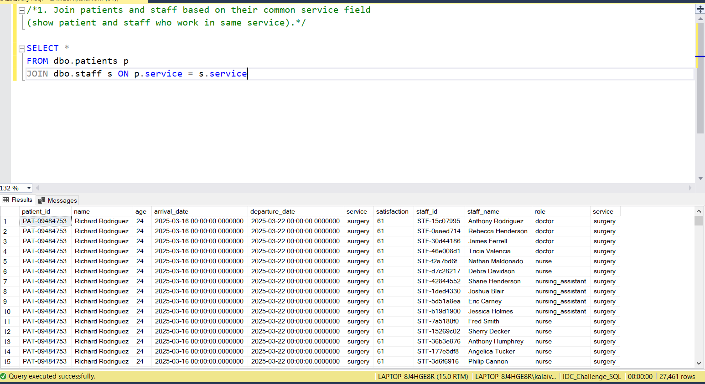
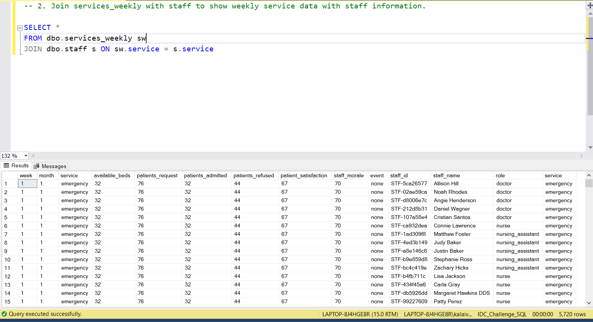
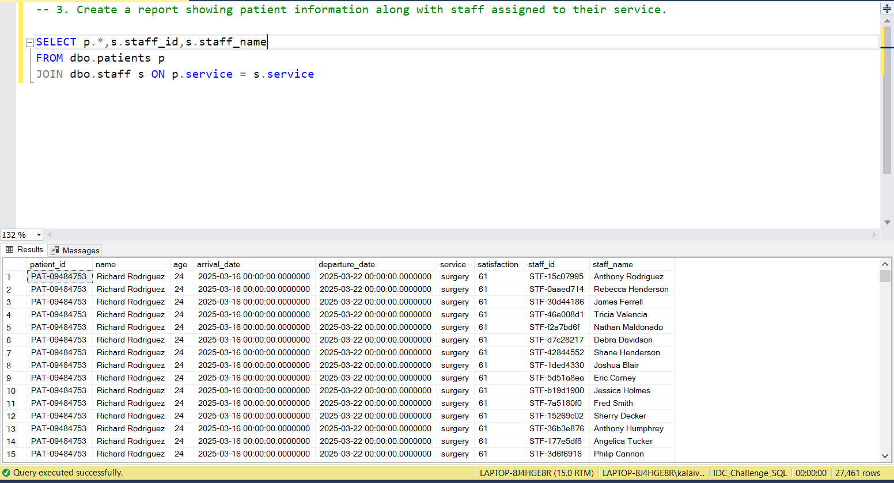
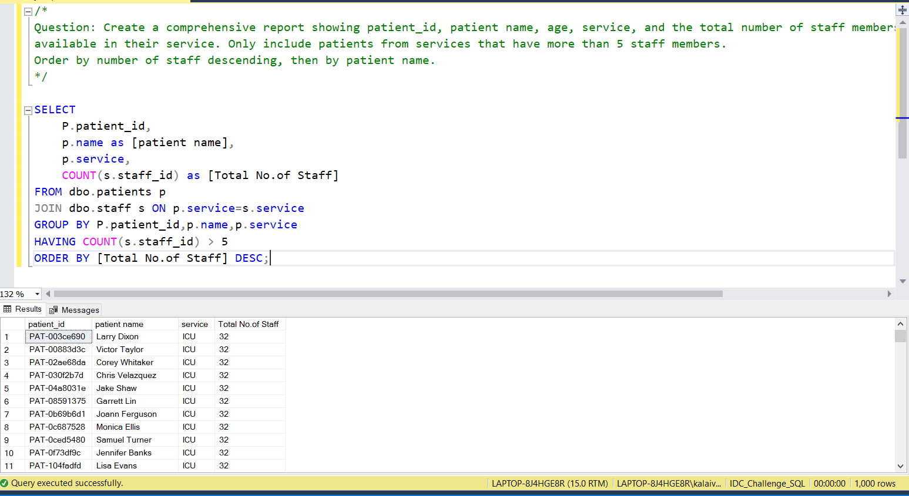

# 📅 Day 13: INNER JOIN
📆 Date: 17/11  

---

## 🧠 Topics Covered
- INNER JOIN
- joining two tables
- relationship understanding

### 💡 Tips & Tricks

✅ Use table aliases for cleaner code:
FROM patients p      -- 'p' is aliasINNER JOIN staff s   -- 's' is alias
​
✅ Always qualify columns in joins to avoid ambiguity:
-- ❌ Ambiguous: SELECT service FROM patients p JOIN staff s...-- ✅ Clear: SELECT p.service FROM patients p JOIN staff s...
​
✅ JOIN is optional - these are the same:
INNER JOIN staff ON...
JOIN staff ON...        -- INNER is default
​
✅ Chain multiple joins:
FROM table1 t1
JOIN table2 t2 ON t1.id = t2.idJOIN table3 t3 ON t2.id = t3.id

✅ Use WHERE after ON for additional filtering:
FROM patients p
JOIN staff s ON p.service = s.service
WHERE p.age > 65

### Basic Syntax

```sql
SELECT columnsFROM table1
INNER JOIN table2 ON table1.column = table2.column;
```

### Practice Outputs

1. Join patients and staff based on their common service field 
(show patient and staff who work in same service).
SELECT *
FROM dbo.patients p
JOIN dbo.staff s ON p.service = s.service



2. Join services_weekly with staff to show weekly service data with staff information.



3. Create a report showing patient information along with staff assigned to their service.



### Daily Challenge Outputs

/*
Question: Create a comprehensive report showing patient_id, patient name, age, service, and the total number of staff members
available in their service. Only include patients from services that have more than 5 staff members. 
Order by number of staff descending, then by patient name.
*/

SELECT 
	P.patient_id,
	p.name as [patient name],
	p.service,
	COUNT(s.staff_id) as [Total No.of Staff]
FROM dbo.patients p
JOIN dbo.staff s ON p.service=s.service
GROUP BY P.patient_id,p.name,p.service
HAVING COUNT(s.staff_id) > 5
ORDER BY [Total No.of Staff] DESC;

