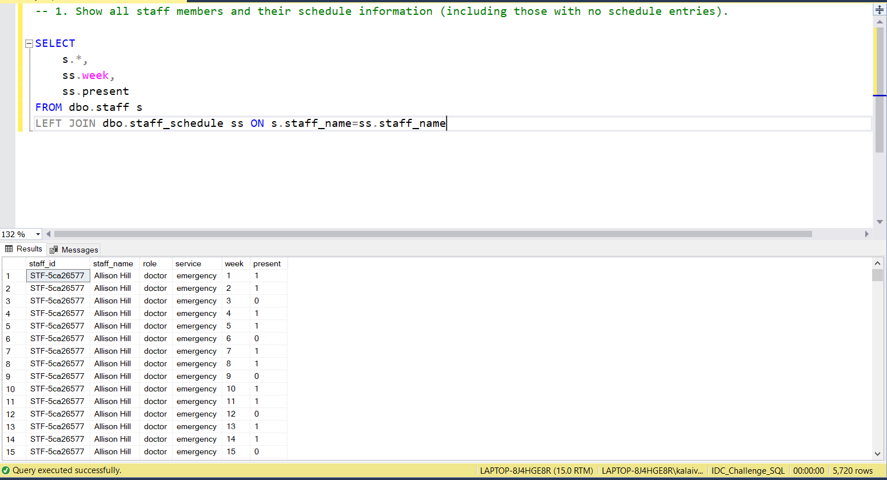
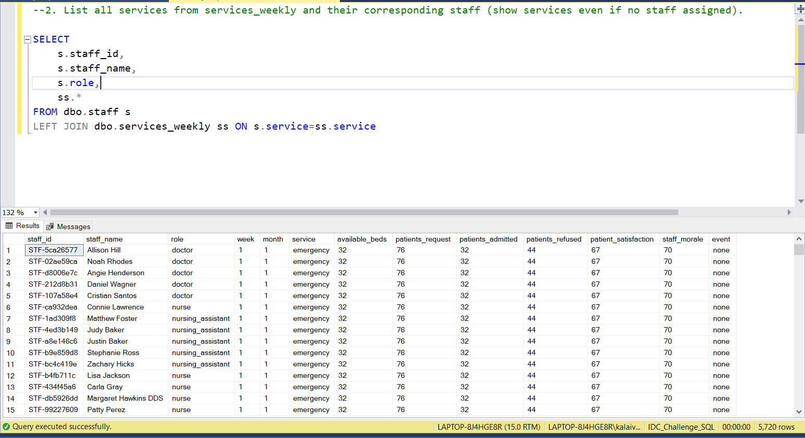
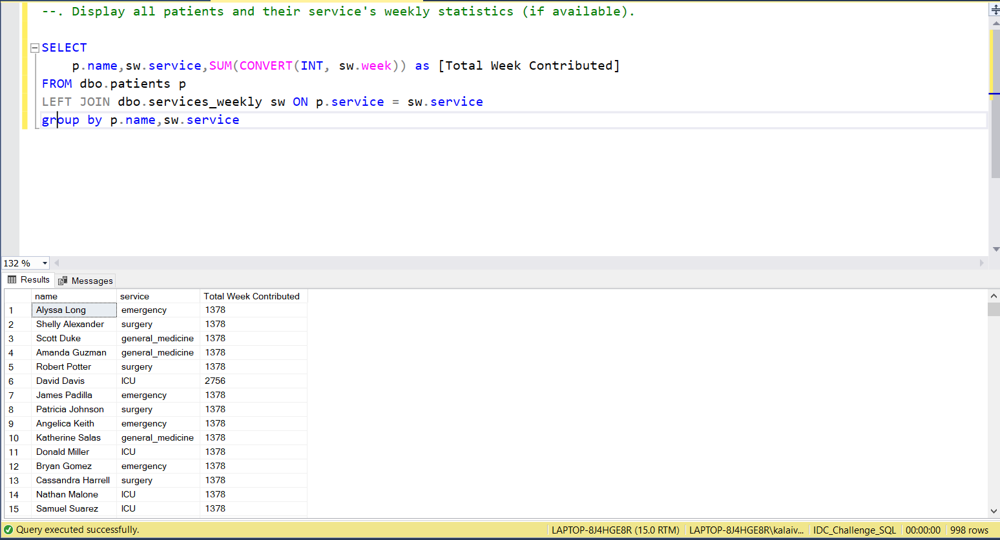
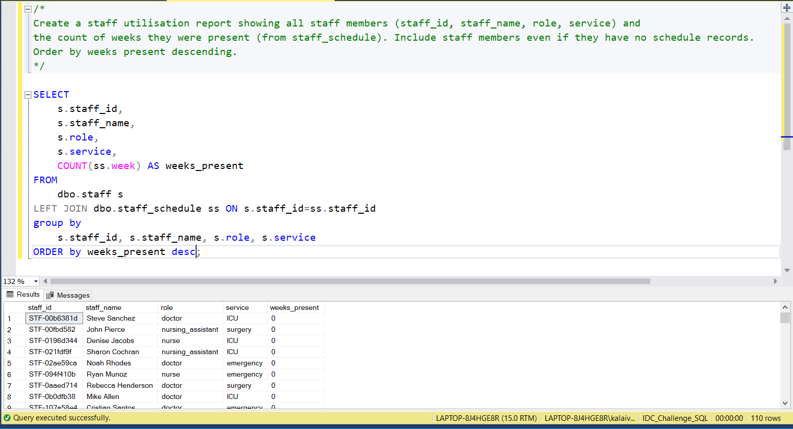

# 📅 Day 14: LEFT JOIN and RIGHT JOIN
📆 Date: 18/11  

---

## 🧠 Topics Covered
- LEFT JOIN
- RIGHT JOIN
- including unmatched records
- joining two tables
- relationship understanding

### 💡 Tips & Tricks

✅ **LEFT JOIN is more common than RIGHT JOIN** - you can rewrite RIGHT as LEFT by swapping tables:

```sql
-- These are equivalent:FROM table1 RIGHT JOIN table2 ON ...
FROM table2 LEFT JOIN table1 ON ...
```

✅ **Use COALESCE with LEFT JOIN** to handle NULLs:

```sql
SELECT
    s.staff_name,
    COALESCE(SUM(ss.present), 0) AS weeks_present  -- 0 instead of NULLFROM staff s
LEFT JOIN staff_schedule ss ON s.staff_id = ss.staff_id
```

✅ **Find non-matching rows** using WHERE column IS NULL:

```sql
-- Staff with no schedule entriesFROM staff s
LEFT JOIN staff_schedule ss ON s.staff_id = ss.staff_id
WHERE ss.staff_id IS NULL
```

✅ **WHERE vs ON in LEFT JOIN**:

```sql
-- ON: Filters before joining (keeps all left rows)LEFT JOIN table2 ON condition AND table2.column = 'value'-- WHERE: Filters after joining (can exclude left rows)LEFT JOIN table2 ON condition
WHERE table2.column = 'value'
```

✅ **LEFT JOIN preserves row count** from left table (or increases it with duplicates)

### Basic Syntax

```sql
-- LEFT JOIN (most common)SELECT columnsFROM table1
LEFT JOIN table2 ON table1.column = table2.column;
-- RIGHT JOIN (less common)SELECT columnsFROM table1
RIGHT JOIN table2 ON table1.column = table2.column;
```

### Practice Outputs

1. Show all staff members and their schedule information (including those with no schedule entries).
SELECT 
	s.*,
	ss.week,
	ss.present
FROM dbo.staff s
LEFT JOIN dbo.staff_schedule ss ON s.staff_name=ss.staff_name



2. List all services from services_weekly and their corresponding staff (show services even if no staff assigned).
SELECT 
	s.staff_id,
	s.staff_name,
	s.role,
	ss.*
FROM dbo.staff s
LEFT JOIN dbo.services_weekly ss ON s.service=ss.service



3. Display all patients and their service's weekly statistics (if available).
SELECT 
	p.name,sw.service,SUM(CONVERT(INT, sw.week)) as [Total Week Contributed]
FROM dbo.patients p
LEFT JOIN dbo.services_weekly sw ON p.service = sw.service
group by p.name,sw.service



### Daily Challenge Outputs

Create a staff utilisation report showing all staff members (staff_id, staff_name, role, service) and the count of weeks they were present (from staff_schedule). Include staff members even if they have no schedule records. Order by weeks present descending.

SELECT
	s.staff_id,
	s.staff_name,
	s.role,
	s.service,
	COUNT(ss.week) AS weeks_present
FROM
	dbo.staff s
LEFT JOIN dbo.staff_schedule ss ON s.staff_id=ss.staff_id
group by 
	s.staff_id, s.staff_name, s.role, s.service
ORDER by weeks_present desc;




NOTE: As I noticed some issues in dataset ,the output varies