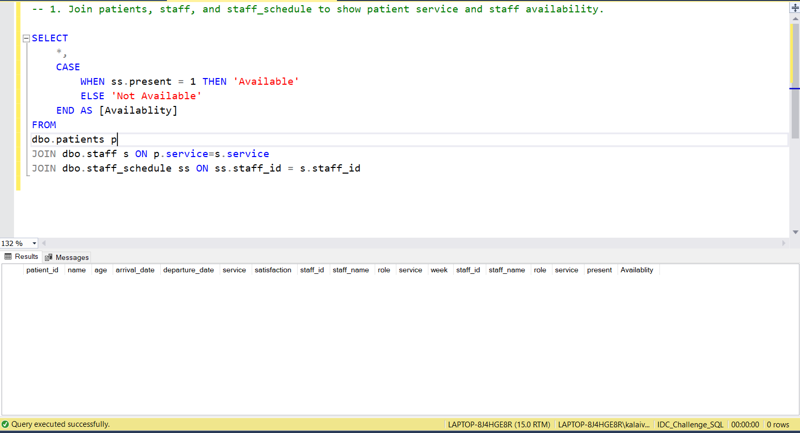
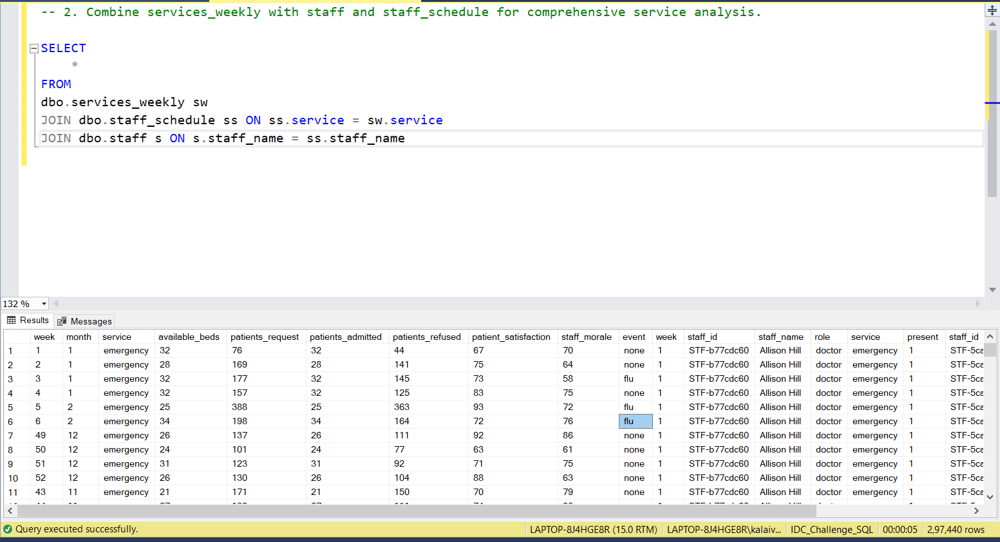
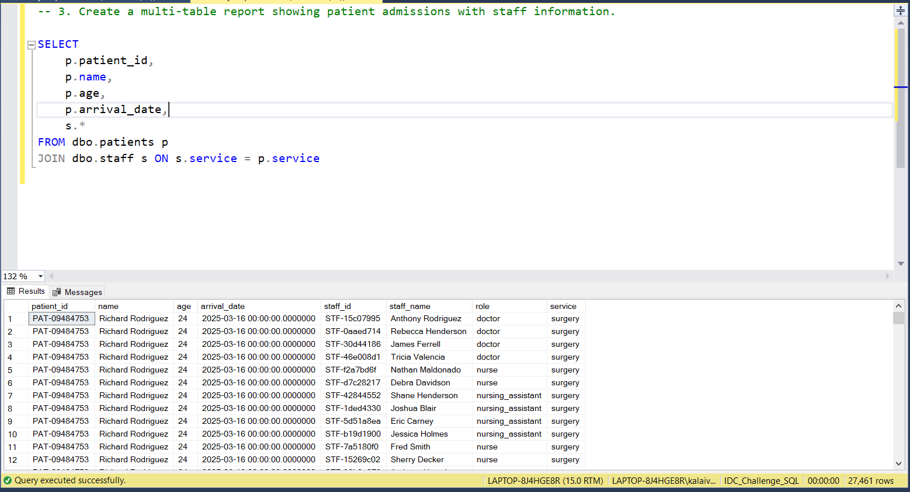
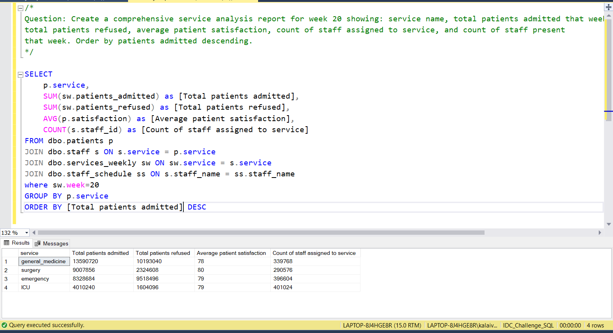

# 📅 Day 15: Multiple Joins
📆 Date: 19/11  

---

## 🧠 Topics Covered
- Joining more than two tables,
- complex relationships
- joining two tables
- relationship understanding

### 💡 Tips & Tricks

✅ **Start with the main table** (the one you want all rows from)

✅ **Use LEFT JOIN when you want all rows** from the left table, INNER JOIN when you only want matches

✅ **Join order matters** with mixed join types:

```sql
-- These can produce different results:FROM table1
LEFT JOIN table2 ON ...
INNER JOIN table3 ON ...
FROM table1
INNER JOIN table3 ON ...
LEFT JOIN table2 ON ...
```

✅ **Watch for join conditions** across multiple tables:

```sql
-- Join condition can reference earlier tablesFROM t1
JOIN t2 ON t1.id = t2.idJOIN t3 ON t1.id = t3.id AND t2.status = 'active'
```

✅ **Use DISTINCT or GROUP BY** if joins create duplicates

✅ **Test joins incrementally** - add one join at a time to verify results

### Basic Syntax

```sql
SELECT columnsFROM table1
JOIN table2 ON table1.key = table2.keyJOIN table3 ON table2.key = table3.keyLEFT JOIN table4 ON table3.key = table4.key;
```

### Practice Outputs

1. Join patients, staff, and staff_schedule to show patient service and staff availability.
SELECT 
	*,
	CASE 
		WHEN ss.present = 1 THEN 'Available'
		ELSE 'Not Available'
	END AS [Availablity]
FROM
dbo.patients p
JOIN dbo.staff s ON p.service=s.service
JOIN dbo.staff_schedule ss ON ss.staff_id = s.staff_id



NOTE: Because of data discrepancies, the output is not accurate.

2. Combine services_weekly with staff and staff_schedule for comprehensive service analysis.
SELECT 
	*
FROM
dbo.services_weekly sw
JOIN dbo.staff_schedule ss ON ss.service = sw.service
JOIN dbo.staff s ON s.staff_name = ss.staff_name



NOTE: Not Joined based on staff_id Because of data discrepancies, the output is not accurate.

3. Create a multi-table report showing patient admissions with staff information.
SELECT 
	p.patient_id,
	p.name,
	p.age,
	p.arrival_date,
	s.*
FROM dbo.patients p
JOIN dbo.staff s ON s.service = p.service



NOTE: Because of data discrepancies, the output is not accurate.

### Daily Challenge Outputs

/*
Question: Create a comprehensive service analysis report for week 20 showing: service name, total patients admitted that week,
total patients refused, average patient satisfaction, count of staff assigned to service, and count of staff present
that week. Order by patients admitted descending.
*/

SELECT 
	p.service,
	SUM(sw.patients_admitted) as [Total patients admitted],
	SUM(sw.patients_refused) as [Total patients refused],
	AVG(p.satisfaction) as [Average patient satisfaction],
	COUNT(s.staff_id) as [Count of staff assigned to service]
FROM dbo.patients p
JOIN dbo.staff s ON s.service = p.service
JOIN dbo.services_weekly sw ON sw.service = s.service
JOIN dbo.staff_schedule ss ON s.staff_name = ss.staff_name
where sw.week=20
GROUP BY p.service
ORDER BY [Total patients admitted] DESC



NOTE: Because of data discrepancies, the output is not accurate.
