# 📅 Day 16: Mini Project (The Great Pizza Analytics Challenge)
📆 Date: 20/11  

---

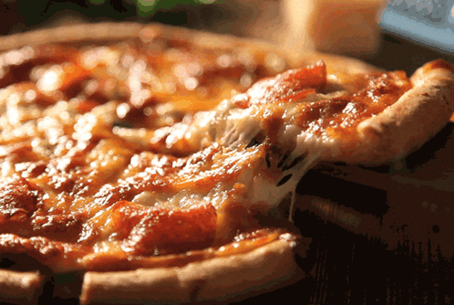

### Welcome to the **Great Pizza Analytics Challenge**!

You are the data analyst for **IDC Pizza**, tasked with transforming raw pizza sales data into actionable insights.

Your goal is to answer a series of questions **using SQL**, practicing the topics covered up to Day 15:

- Database creation & table design
- Filtering & operators (`WHERE`, `IN`, `BETWEEN`, `LIKE`, `AND/OR/NOT`)
- Aggregations (`SUM`, `AVG`, `COUNT`, `MIN`, `MAX`, `GROUP BY`, `HAVING`)
- Joins (`INNER JOIN`, `LEFT JOIN`, `RIGHT JOIN`, `FULL OUTER JOIN`, `SELF JOIN`)
- Data cleaning (`DISTINCT`, `COALESCE`, handling NULLs)

**Important:** You **must not** include your answers in the main question file. Answers should be submitted in a separate CSV.

## **Questions**

**Phase 1: Foundation & Inspection**

1. Install IDC_Pizza.dump as IDC_Pizza server
2. List all unique pizza categories (`DISTINCT`).
3. Display `pizza_type_id`, `name`, and ingredients, replacing NULL ingredients with `"Missing Data"`. Show first 5 rows.
4. Check for pizzas missing a price (`IS NULL`).

### Ans:

2. List all unique pizza categories (`DISTINCT`).
select DISTINCT category from dbo.pizza_types

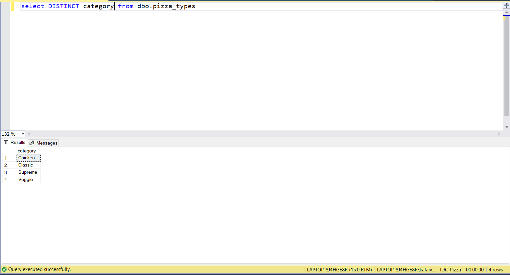

3. Display `pizza_type_id`, `name`, and ingredients, replacing NULL ingredients with `"Missing Data"`. Show first 5 rows.
SELECT TOP 5 
    pizza_type_id,
    name,
    ISNULL(ingredients, 'Missing Data') AS ingredients
FROM dbo.pizza_types;

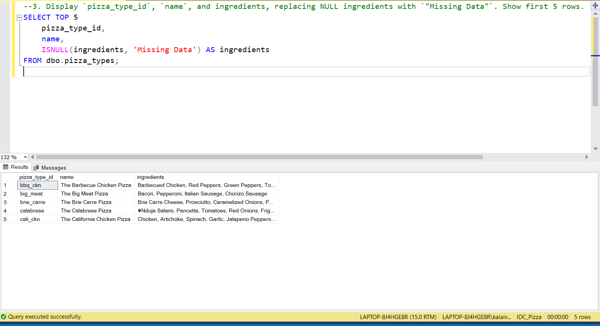

4. Check for pizzas missing a price (`IS NULL`).
SELECT * FROM
pizzas
WHERE price is null

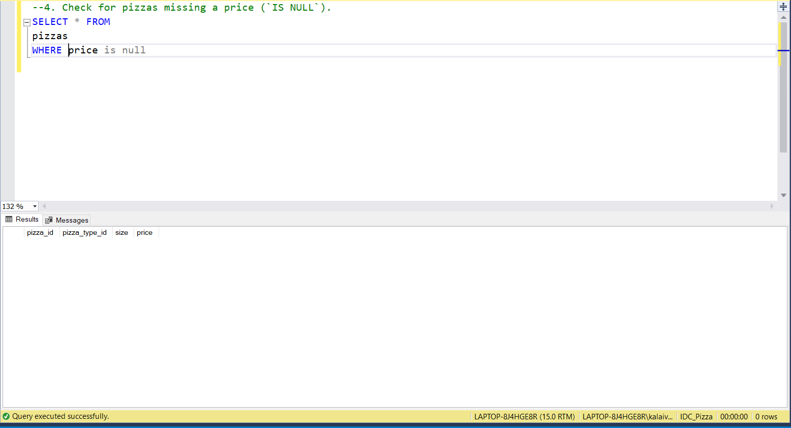

**Phase 2: Filtering & Exploration**

1. Orders placed on `'2015-01-01'` (`SELECT` + `WHERE`).
2. List pizzas with `price` descending.
3. Pizzas sold in sizes `'L'` or `'XL'`.
4. Pizzas priced between $15.00 and $17.00.
5. Pizzas with `"Chicken"` in the name.
6. Orders on `'2015-02-15'` or placed after 8 PM.

### Ans

1. Orders placed on `'2015-01-01'` (`SELECT` + `WHERE`).
SELECT * FROM orders
WHERE date = '2015-01-01'

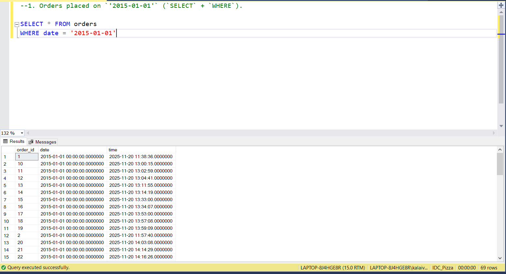

2. List pizzas with `price` descending.
SELECT * FROM dbo.pizzas
ORDER BY price DESC

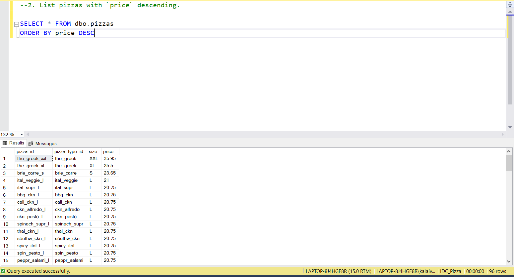

3. Pizzas sold in sizes `'L'` or `'XL'`.
SELECT 
    *
FROM dbo.pizzas
WHERE size IN ('L', 'XL');

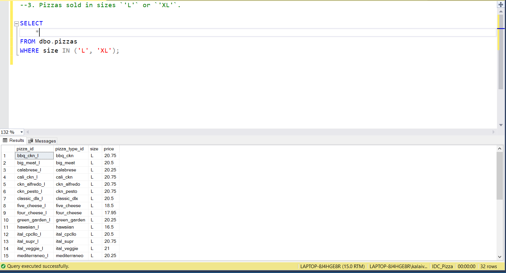

4. Pizzas priced between $15.00 and $17.00.
SELECT 
    *
FROM dbo.pizzas
WHERE price between 15.00 and 17.00

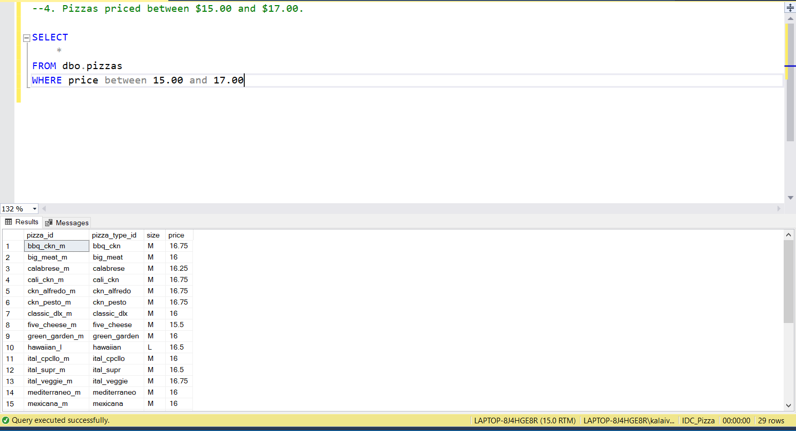

5. Pizzas with "Chicken" in the name.

SELECT 
    pizza_type_id,
	name,
	category
FROM dbo.pizza_types
where name like '%Chicken%'

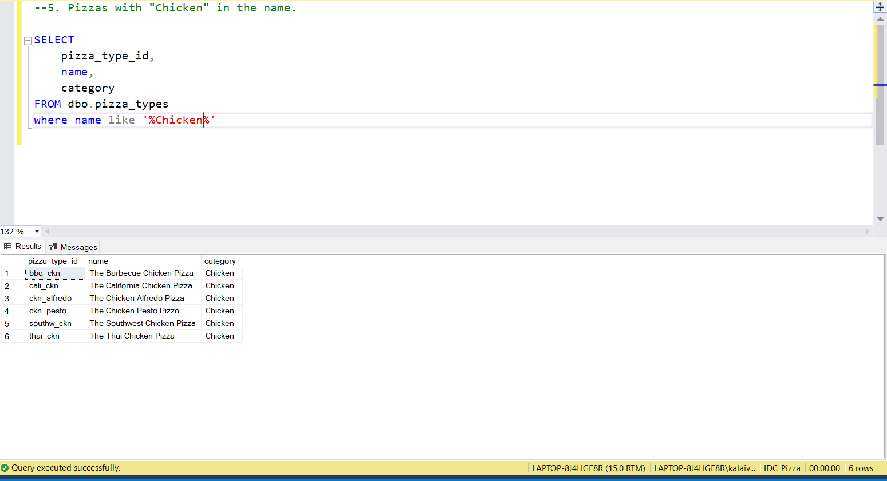

6. Orders on `'2015-02-15'` or placed after 8 PM.
SELECT 
    *
FROM dbo.orders
WHERE date = '2015-02-15' or time = '20:00:00'

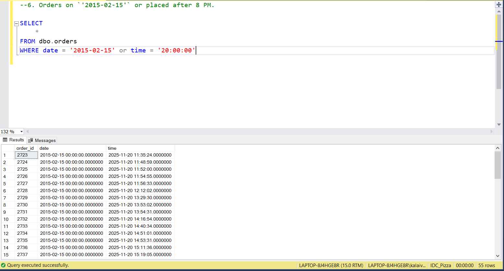

**Phase 3: Sales Performance**

1. Total quantity of pizzas sold (`SUM`).
2. Average pizza price (`AVG`).
3. Total order value per order (`JOIN`, `SUM`, `GROUP BY`).
4. Total quantity sold per pizza category (`JOIN`, `GROUP BY`).
5. Categories with more than 5,000 pizzas sold (`HAVING`).
6. Pizzas never ordered (`LEFT/RIGHT JOIN`).
7. Price differences between different sizes of the same pizza (`SELF JOIN`).

### Ans:

1. Total quantity of pizzas sold (`SUM`).
SELECT
	SUM(quantity) as [Total quantity of pizzas sold]
FROM dbo.order_details

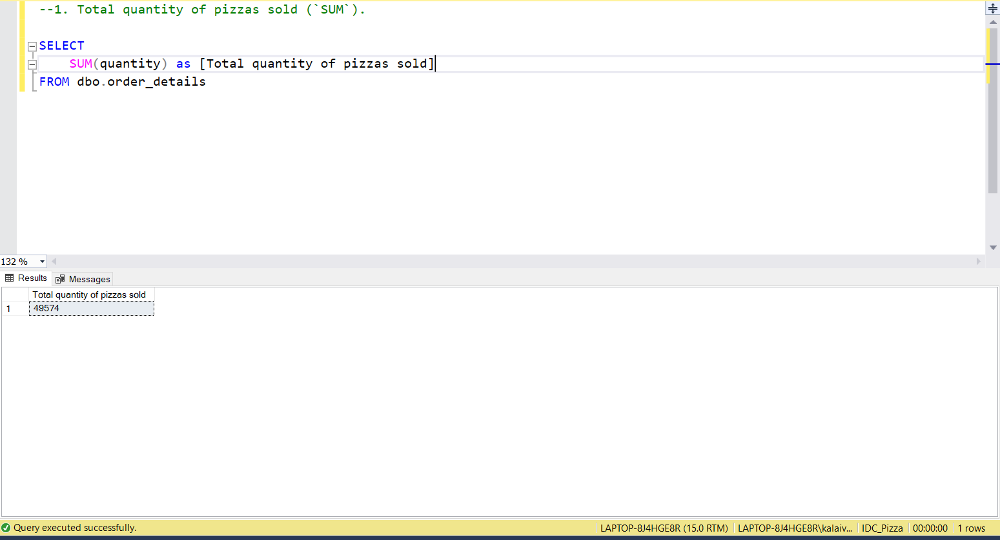

2. Average pizza price (`AVG`).
SELECT 
	AVG(price) as [Average pizza price]
FROM pizzas

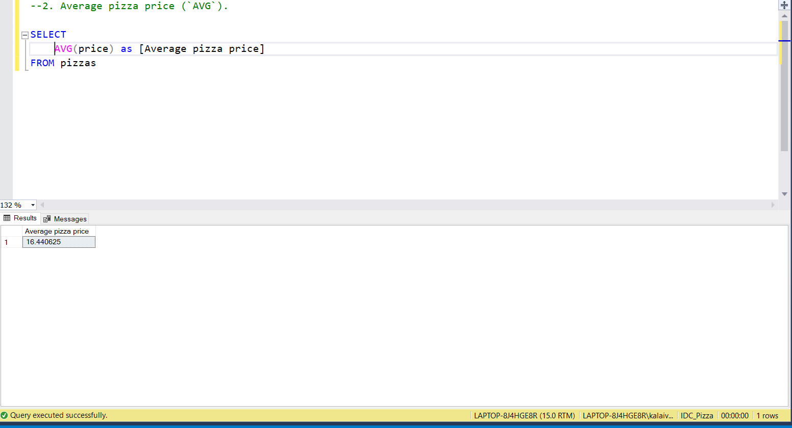

3. Total order value per order (`JOIN`, `SUM`, `GROUP BY`).
SELECT
	od.order_id,
	SUM(od.quantity * p.price) AS total_order_value
FROM dbo.order_details od
JOIN dbo.pizzas p
	ON od.pizza_id = p.pizza_id
GROUP BY od.order_id
ORDER BY od.order_id

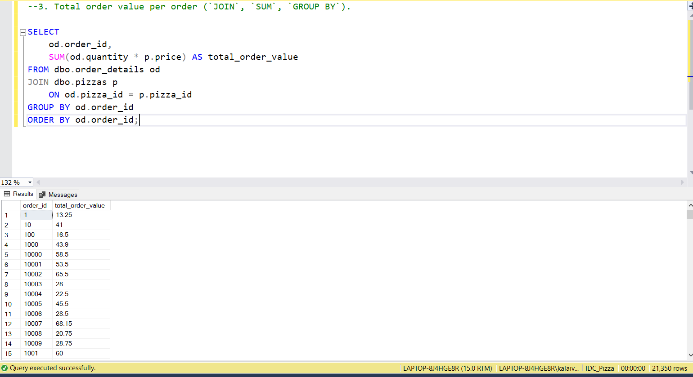

4. Total quantity sold per pizza category (`JOIN`, `GROUP BY`).
SELECT
	pt.category,
	SUM(od.quantity) AS [Total quantity sold per pizza]
FROM dbo.order_details od
JOIN dbo.pizzas p ON p.pizza_id = od.pizza_id
JOIN dbo.pizza_types pt ON p.pizza_type_id = pt.pizza_type_id
GROUP By pt.category
ORDER BY [Total quantity sold per pizza] DESC

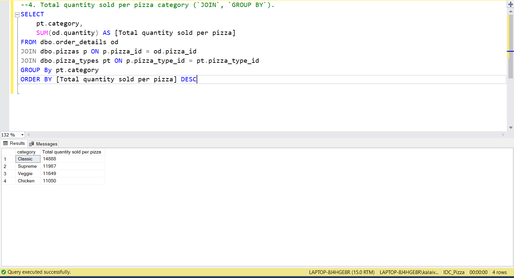

5. Categories with more than 5,000 pizzas sold (`HAVING`).
SELECT
	pt.category,
	SUM(od.quantity) AS [Total quantity sold per pizza]
FROM dbo.order_details od
JOIN dbo.pizzas p ON p.pizza_id = od.pizza_id
JOIN dbo.pizza_types pt ON p.pizza_type_id = pt.pizza_type_id
GROUP By pt.category
HAVING SUM(od.quantity) > 5000
ORDER BY [Total quantity sold per pizza] DESC

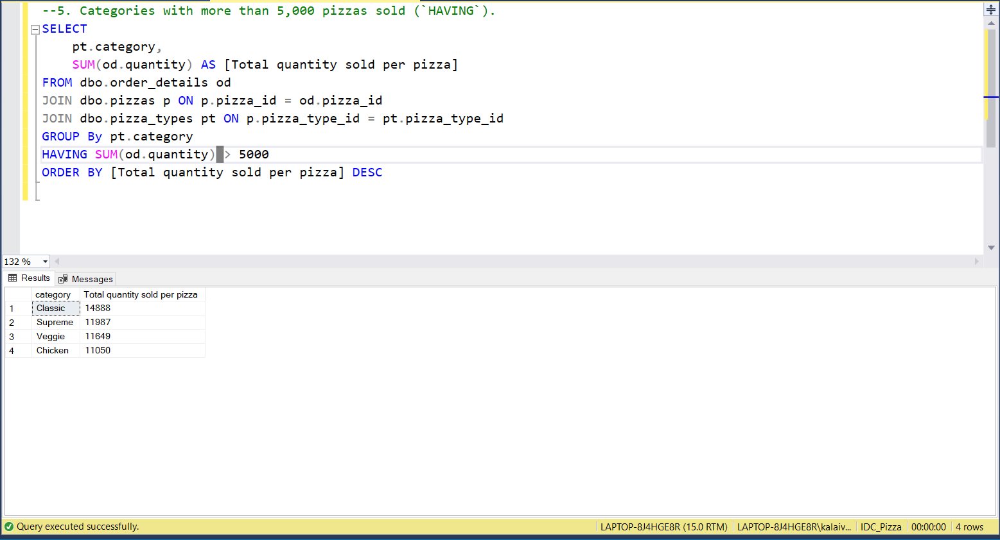

6. Pizzas never ordered (`LEFT/RIGHT JOIN`).
SELECT
	p.pizza_id
FROM dbo.order_details od
LEFT JOIN pizzas p ON p.pizza_id = od.pizza_id
WHERE p.pizza_id is NULL

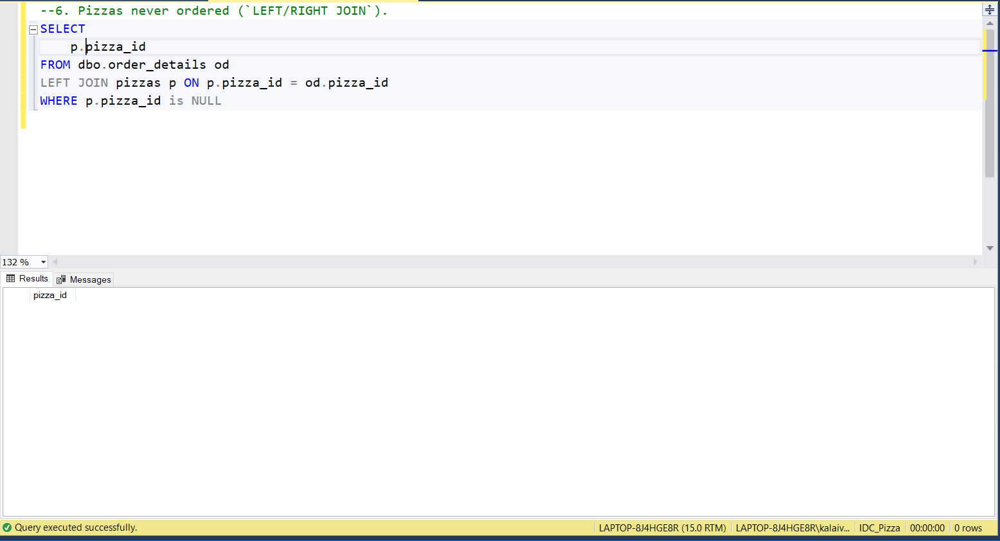

7. Price differences between different sizes of the same pizza (`SELF JOIN`).
SELECT 
    p1.pizza_type_id,
    p1.size AS size_1,
    p1.price AS price_1,
    p2.size AS size_2,
    p2.price AS price_2,
    ABS((p2.price - p1.price)) AS price_difference1,
	p3.size as size_3,
	p3.price as prize_3,
	ABS((p2.price - p3.price)) AS price_difference2
FROM pizzas p1
JOIN pizzas p2 ON p1.pizza_type_id = p2.pizza_type_id AND p1.size < p2.size
JOIN pizzas p3 ON p1.pizza_type_id = p3.pizza_type_id AND p2.size < p3.size

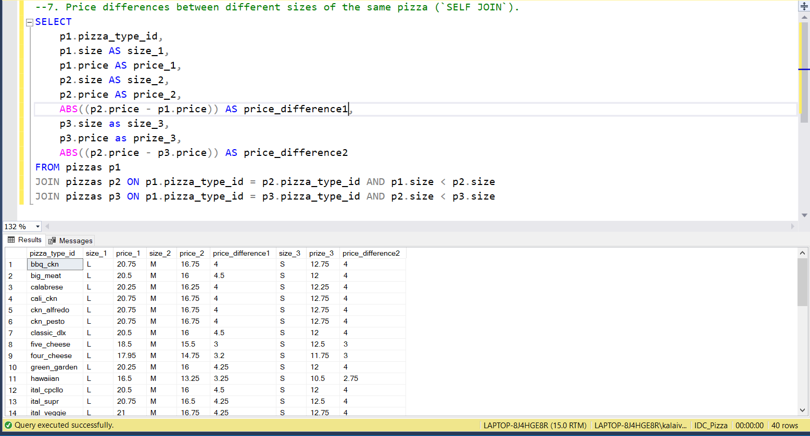