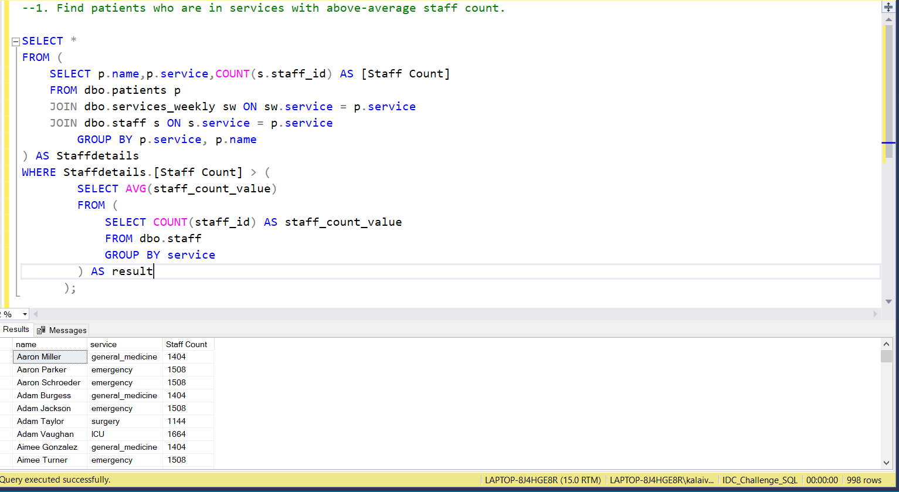
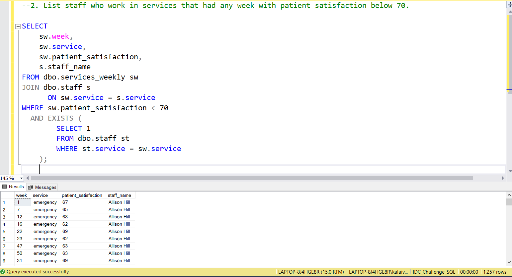
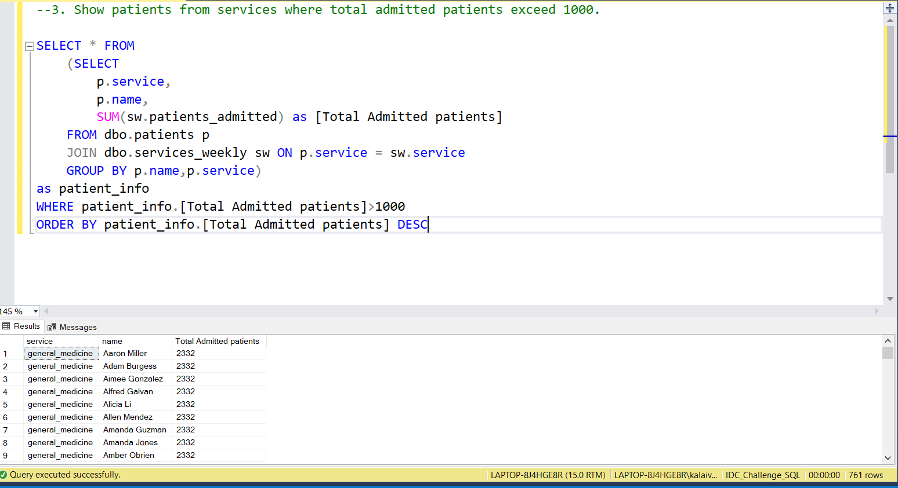
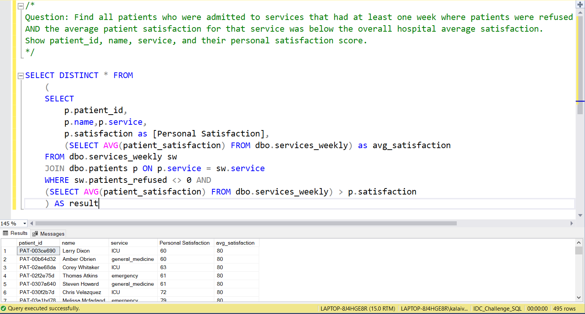

# 📅 Day 17: Subqueries (WHERE clause)
📆 Date: 21/11  

---

## 🧠 Topics Covered
- Subqueries in WHERE
- nested queries
- filtering with subqueries

### 💡 Tips & Tricks

✅ **IN vs EXISTS**:
- Use IN for small result sets
- Use EXISTS for better performance with large datasets

✅ **Correlated subqueries** reference outer query:

```sql
-- Find patients with above-average satisfaction in their serviceSELECT *FROM patients p1
WHERE satisfaction > (
    SELECT AVG(satisfaction)
    FROM patients p2
    WHERE p2.service = p1.service  -- References outer query);
```

✅ **Handle NULLs with NOT IN**:

```sql
-- NOT IN with NULL returns no rows! Use NOT EXISTS or IS NOT NULLWHERE service NOT IN (SELECT service FROM table WHERE service IS NOT NULL)
```

✅ **Single-value subqueries** must return exactly one row:

```sql
WHERE age > (SELECT AVG(age) FROM patients)  -- Must return single value
```

✅ **Test subqueries independently** first to verify they return expected results

✅ **Subqueries in WHERE are evaluated for each row** - can be slow on large datasets

### Basic Syntax

```sql
SELECT columnsFROM table1
WHERE column IN (
    SELECT column    FROM table2
    WHERE condition
);
```

### Practice Outputs

1. Find patients who are in services with above-average staff count.
SELECT *
FROM (
    SELECT p.name,p.service,COUNT(s.staff_id) AS [Staff Count]
	FROM dbo.patients p
	JOIN dbo.services_weekly sw ON sw.service = p.service
	JOIN dbo.staff s ON s.service = p.service
		GROUP BY p.service, p.name
) AS Staffdetails 
WHERE Staffdetails.[Staff Count] > (
        SELECT AVG(staff_count_value)
        FROM (
            SELECT COUNT(staff_id) AS staff_count_value
            FROM dbo.staff
            GROUP BY service
        ) AS result
      );



NOTE: Because of data discrepancies, the output is not accurate.

2. List staff who work in services that had any week with patient satisfaction below 70.
SELECT 
    sw.week,
    sw.service,
    sw.patient_satisfaction,
    s.staff_name
FROM dbo.services_weekly sw
JOIN dbo.staff s 
      ON sw.service = s.service
WHERE sw.patient_satisfaction < 70
  AND EXISTS (
        SELECT 1
        FROM dbo.staff st
        WHERE st.service = sw.service
    );



NOTE: Not Joined based on staff_id Because of data discrepancies, the output is not accurate.

3. Show patients from services where total admitted patients exceed 1000.
SELECT * FROM
	(SELECT 
		p.service,
		p.name,
		SUM(sw.patients_admitted) as [Total Admitted patients]
	FROM dbo.patients p
	JOIN dbo.services_weekly sw ON p.service = sw.service
	GROUP BY p.name,p.service) 
as patient_info 
WHERE patient_info.[Total Admitted patients]>1000
ORDER BY patient_info.[Total Admitted patients] DESC



NOTE: Because of data discrepancies, the output is not accurate.

### Daily Challenge Outputs
/*
Question: Find all patients who were admitted to services that had at least one week where patients were refused 
AND the average patient satisfaction for that service was below the overall hospital average satisfaction.
Show patient_id, name, service, and their personal satisfaction score.
*/
SELECT DISTINCT * FROM
	(
	SELECT 
		p.patient_id,
		p.name,p.service,
		p.satisfaction as [Personal Satisfaction],
		(SELECT AVG(patient_satisfaction) FROM dbo.services_weekly) as avg_satisfaction
	FROM dbo.services_weekly sw
	JOIN dbo.patients p ON p.service = sw.service
	WHERE sw.patients_refused <> 0 AND
	(SELECT AVG(patient_satisfaction) FROM dbo.services_weekly) > p.satisfaction
	) AS result



NOTE: Because of data discrepancies, the output is not accurate.
