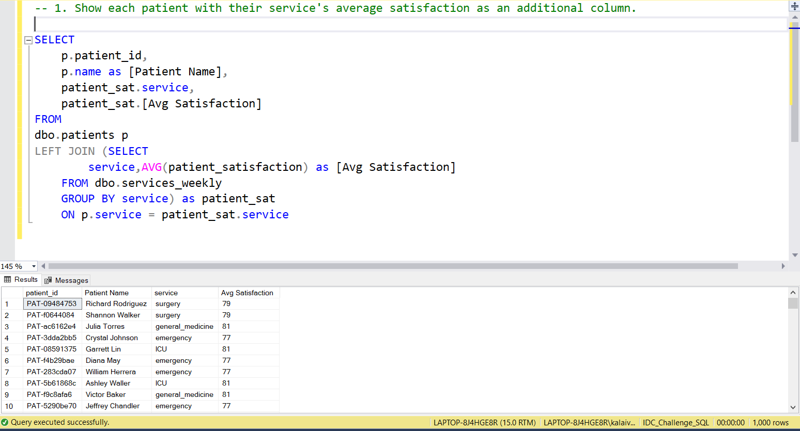
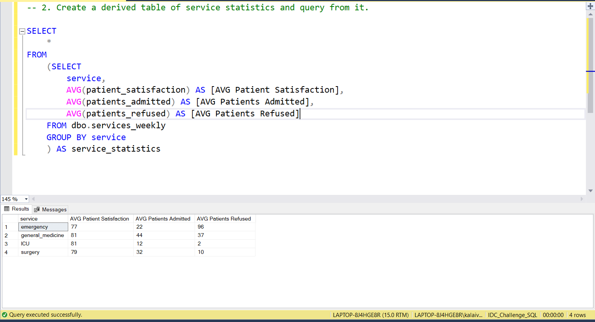
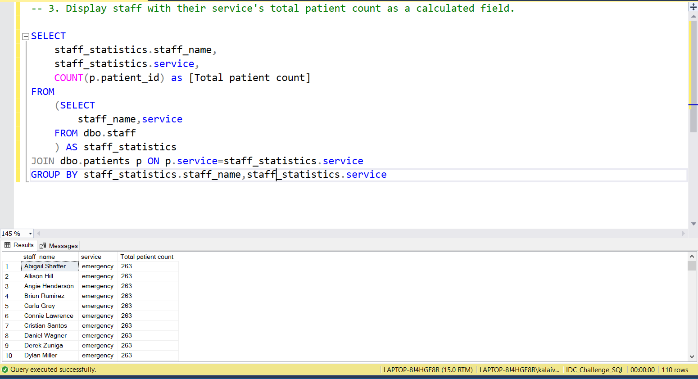
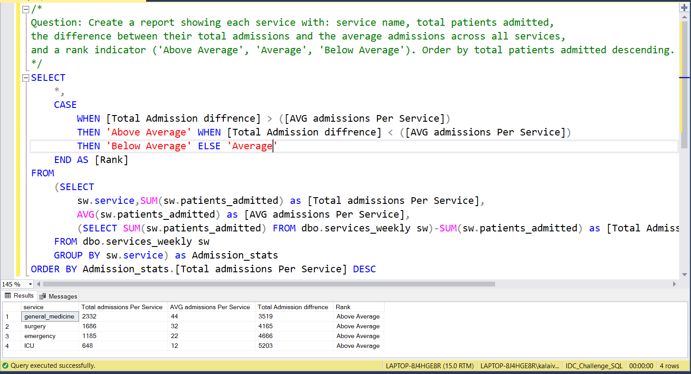

# 📅 Day 17:  Subqueries (SELECT and FROM clause)
📆 Date: 22/11  

---

## 🧠 Topics Covered
- Subqueries in SELECT
- derived tables
- inline views

✅ **Always alias derived tables**:

```sql
-- ❌ Missing alias: FROM (SELECT ...)-- ✅ Correct: FROM (SELECT ...) AS alias
```

✅ **Subquery in SELECT must return single value**:

```sql
-- This works (single value):SELECT name, (SELECT COUNT(*) FROM staff) AS total_staff
-- This fails (multiple values):SELECT name, (SELECT staff_name FROM staff)  -- ERROR
```

✅ **Use derived tables to organize complex logic**:

```sql
-- Instead of one massive query, break into logical stepsFROM (
    -- Step 1: Calculate metrics    SELECT service, COUNT(*) as count FROM patients GROUP BY service
) AS step1
JOIN (
    -- Step 2: Calculate different metrics    SELECT service, AVG(satisfaction) as avg_sat FROM patients GROUP BY service
) AS step2 ON step1.service = step2.service
```

✅ **CTEs (Day 21) are often cleaner** than derived tables for complex queries

✅ **Correlated subqueries in SELECT** execute once per row (can be slow):

```python
SELECT
    p.name,
    (SELECT AVG(satisfaction)
     FROM patients p2
     WHERE p2.service = p.service) AS service_avg  -- Runs for each patientFROM patients p;
```

### Basic Syntax

```sql
-- Subquery in SELECTSELECT
    column1,
    (SELECT aggregate FROM table2 WHERE condition) AS calculated_column
FROM table1;
-- Subquery in FROM (derived table)SELECT *FROM (
    SELECT column1, column2
    FROM table    WHERE condition
) AS subquery_alias;
```

### Practice Outputs

1. Show each patient with their service's average satisfaction as an additional column.
SELECT
	p.patient_id,
	p.name as [Patient Name],
	patient_sat.service,
	patient_sat.[Avg Satisfaction]
FROM
dbo.patients p
LEFT JOIN (SELECT 
		service,AVG(patient_satisfaction) as [Avg Satisfaction]
	FROM dbo.services_weekly
	GROUP BY service) as patient_sat
	ON p.service = patient_sat.service



NOTE: Because of data discrepancies, the output is not accurate.

2. Create a derived table of service statistics and query from it.
SELECT
	*
FROM 
	(SELECT 
		service,
		AVG(patient_satisfaction) AS [AVG Patient Satisfaction],
		AVG(patients_admitted) AS [AVG Patients Admitted],
		AVG(patients_refused) AS [AVG Patients Refused]
	FROM dbo.services_weekly
	GROUP BY service
	) AS service_statistics



NOTE: Not Joined based on staff_id Because of data discrepancies, the output is not accurate.

3. Display staff with their service's total patient count as a calculated field.

SELECT
	staff_statistics.staff_name,
	staff_statistics.service,
	COUNT(p.patient_id) as [Total patient count]
FROM 
	(SELECT 
		staff_name,service
	FROM dbo.staff
	) AS staff_statistics
JOIN dbo.patients p ON p.service=staff_statistics.service
GROUP BY staff_statistics.staff_name,staff_statistics.service



NOTE: Because of data discrepancies, the output is not accurate.

### Daily Challenge Outputs

Question: Create a report showing each service with: service name, total patients admitted,
the difference between their total admissions and the average admissions across all services,
and a rank indicator ('Above Average', 'Average', 'Below Average'). Order by total patients admitted descending.

SELECT 
	*,
	CASE 
		WHEN [Total Admission diffrence] > ([AVG admissions Per Service])
		THEN 'Above Average' WHEN [Total Admission diffrence] < ([AVG admissions Per Service])
		THEN 'Below Average' ELSE 'Average'
	END AS [Rank]
FROM
	(SELECT 
		sw.service,SUM(sw.patients_admitted) as [Total admissions Per Service],
		AVG(sw.patients_admitted) as [AVG admissions Per Service],
		(SELECT SUM(sw.patients_admitted) FROM dbo.services_weekly sw)-SUM(sw.patients_admitted) as [Total Admission diffrence]
	FROM dbo.services_weekly sw
	GROUP BY sw.service) as Admission_stats
ORDER BY Admission_stats.[Total admissions Per Service] DESC



NOTE: Because of data discrepancies, the output is not accurate.
