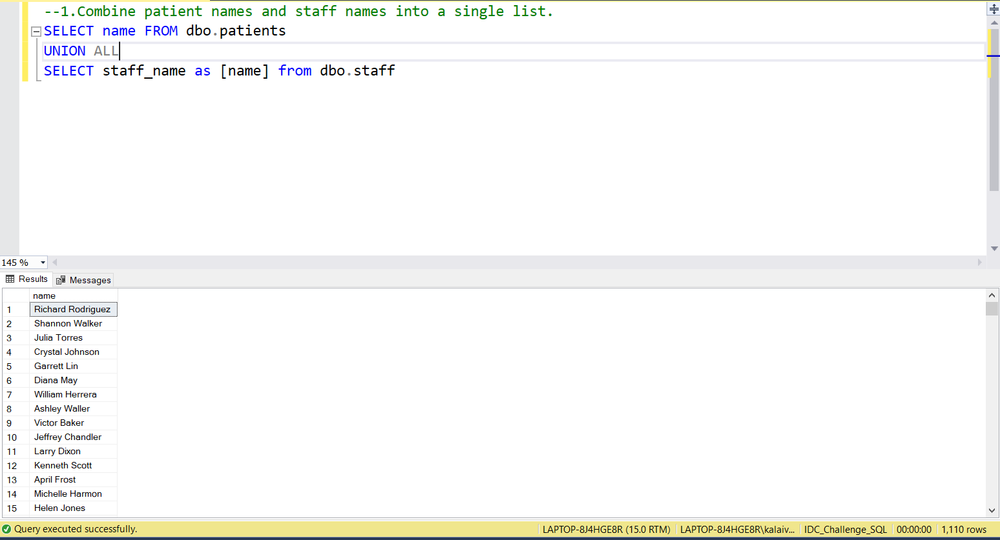
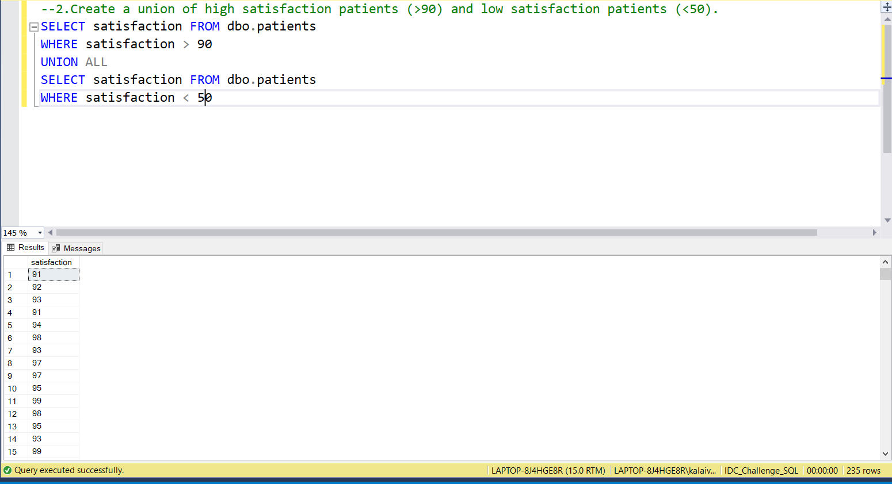
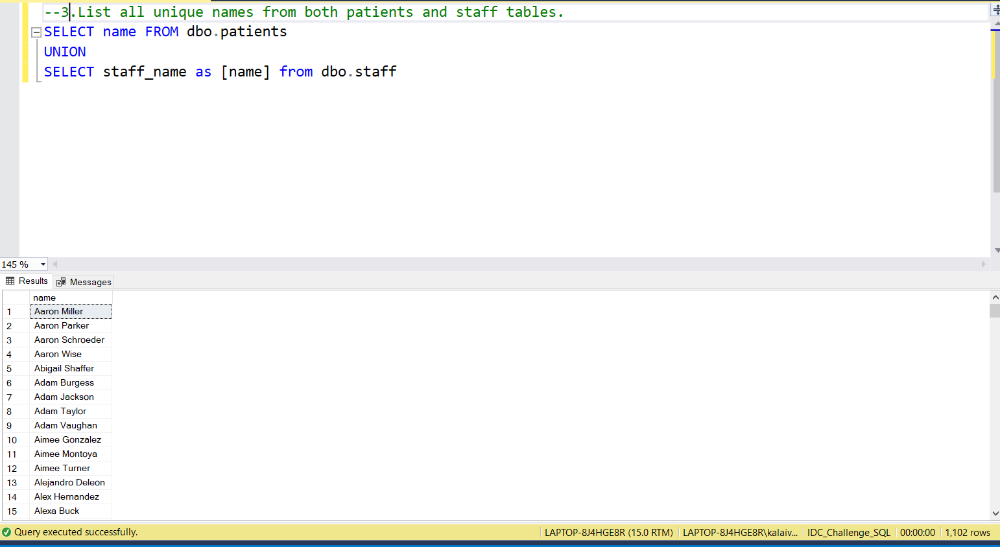
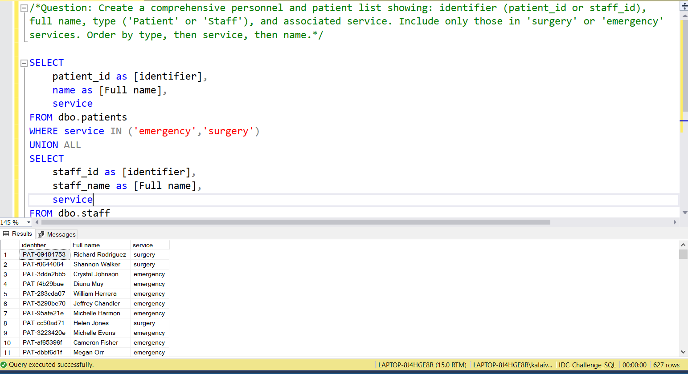

# 📅 Day 18:  UNION and UNION ALL
📆 Date: 24/11  

---

## 🧠 Topics Covered
- UNION: Removes duplicate rows (slower)
- UNION ALL: Keeps all rows including duplicates (faster)	

💡 Tips & Tricks

✅ **Use UNION ALL when possible** - it’s faster since it doesn’t check for duplicates:

```sql
-- If you know there are no duplicates, use UNION ALLSELECT * FROM patients WHERE age < 30UNION ALLSELECT * FROM patients WHERE age > 60  -- No overlap, use UNION ALL
```

✅ **Column names from first query are used**:

```sql
SELECT name AS patient_name FROM patients  -- Result uses 'patient_name'UNIONSELECT staff_name FROM staff  -- 'staff_name' ignored
```

✅ **Use literals to identify source**:

```sql
SELECT name, 'Patient' AS source FROM patients
UNION ALLSELECT staff_name, 'Staff' AS source FROM staff
```

✅ **Order by applies to final result**:

```sql
-- ORDER BY goes at the end (not in individual queries)SELECT name FROM patients
UNIONSELECT staff_name FROM staff
ORDER BY name;  -- Sorts combined result
```

```python
SELECT
    p.name,
    (SELECT AVG(satisfaction)
     FROM patients p2
     WHERE p2.service = p.service) AS service_avg  -- Runs for each patientFROM patients p;
```

### Basic Syntax

```sql
SELECT column1, column2 FROM table1
UNION [ALL]
SELECT column1, column2 FROM table2;
```

### Practice Outputs

1. Combine patient names and staff names into a single list.
SELECT name FROM dbo.patients
UNION ALL
SELECT staff_name as [name] from dbo.staff



NOTE: Because of data discrepancies, the output is not accurate.

2. Create a union of high satisfaction patients (>90) and low satisfaction patients (<50).
SELECT satisfaction FROM dbo.patients
WHERE satisfaction > 90
UNION ALL
SELECT satisfaction FROM dbo.patients
WHERE satisfaction < 50



NOTE: Not Joined based on staff_id Because of data discrepancies, the output is not accurate.

3.List all unique names from both patients and staff tables.
SELECT name FROM dbo.patients
UNION
SELECT staff_name as [name] from dbo.staff



NOTE: Because of data discrepancies, the output is not accurate.

### Daily Challenge Outputs

/*Question: Create a comprehensive personnel and patient list showing: identifier (patient_id or staff_id),
full name, type ('Patient' or 'Staff'), and associated service. Include only those in 'surgery' or 'emergency'
services. Order by type, then service, then name.*/

SELECT 
	patient_id as [identifier],
	name as [Full name],
	service
FROM dbo.patients
WHERE service IN ('emergency','surgery')
UNION ALL
SELECT 
	staff_id as [identifier],
	staff_name as [Full name],
	service
FROM dbo.staff



NOTE: Because of data discrepancies, the output is not accurate.
