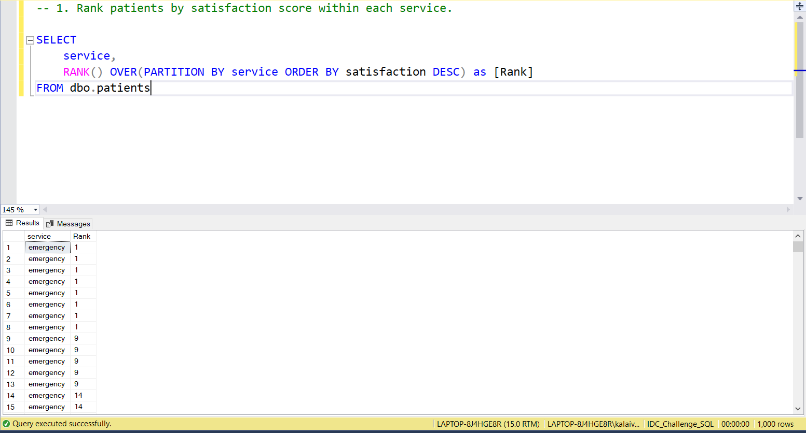
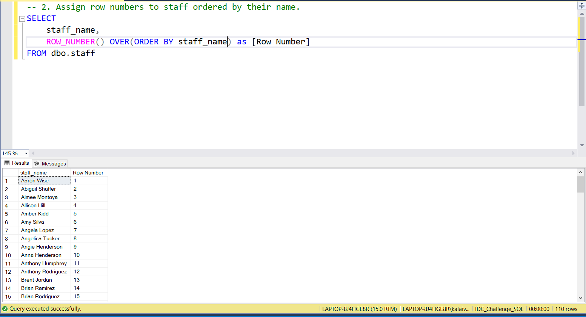
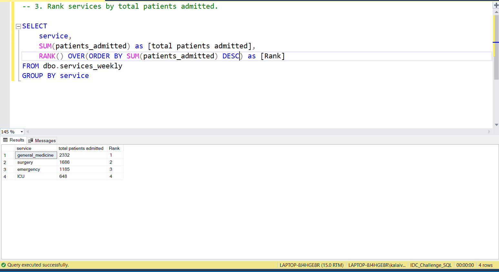
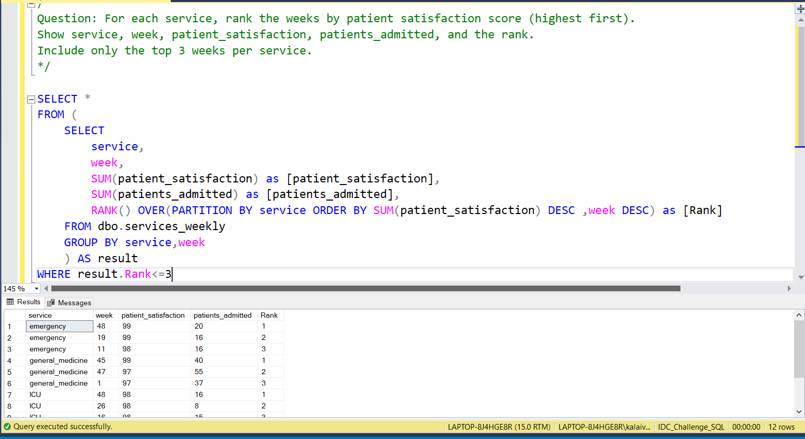

# 📅 Day 19:  Window Functions - ROW_NUMBER, RANK, DENSE_RANK
📆 Date: 25/11  

---

## 🧠 Topics Covered
- ROW_NUMBER()
- RANK()
- DENSE_RANK()
- OVER clause

💡 Tips & Tricks

✅ **PARTITION BY is optional** - without it, window applies to entire result set:

```sql
-- Rank across all patientsRANK() OVER (ORDER BY satisfaction DESC)
-- Rank within each serviceRANK() OVER (PARTITION BY service ORDER BY satisfaction DESC)
```

✅ **Choose the right ranking function**:
- ROW_NUMBER() when you need unique numbers
- RANK() when ties should skip numbers (1, 2, 2, 4)
- DENSE_RANK() when ties shouldn’t skip (1, 2, 2, 3)

✅ **Filter ranked results with subquery**:

```sql
-- Can't use WHERE with window functions directly-- Use subquery:SELECT * FROM (
    SELECT *, ROW_NUMBER() OVER (ORDER BY age DESC) AS rn
    FROM patients
) WHERE rn <= 10  -- Top 10 oldest patients
```

✅ **ORDER BY in OVER is different from query ORDER BY**:

```sql
SELECT
    name,
    ROW_NUMBER() OVER (ORDER BY age DESC) AS rn  -- For numberingFROM patients
ORDER BY name;  -- For final result display
```

✅ **Window functions don’t reduce rows** like GROUP BY - each input row gets an output row

### Basic Syntax

```sql
window_function() OVER (
    [PARTITION BY column]
    [ORDER BY column]
)
```

### Practice Outputs

1. Rank patients by satisfaction score within each service.
SELECT
	service,
	RANK() OVER(PARTITION BY service ORDER BY satisfaction DESC) as [Rank]
FROM dbo.patients



NOTE: Because of data discrepancies, the output is not accurate.

2. Assign row numbers to staff ordered by their name.
SELECT 
	staff_name,
	ROW_NUMBER() OVER(ORDER BY staff_name) as [Row Number]
FROM dbo.staff



NOTE: Not Joined based on staff_id Because of data discrepancies, the output is not accurate.

3. Rank services by total patients admitted.
SELECT 
	service,
	SUM(patients_admitted) as [total patients admitted],
	RANK() OVER(ORDER BY SUM(patients_admitted) DESC) as [Rank]
FROM dbo.services_weekly
GROUP BY service



NOTE: Because of data discrepancies, the output is not accurate.

### Daily Challenge Outputs

/*
Question: For each service, rank the weeks by patient satisfaction score (highest first). Show service, week, patient_satisfaction, patients_admitted, and the rank. Include only the top 3 weeks per service.
*/

SELECT *
FROM (
	SELECT
		service,
		week,
		SUM(patient_satisfaction) as [patient_satisfaction],
		SUM(patients_admitted) as [patients_admitted],
		RANK() OVER(PARTITION BY service ORDER BY SUM(patient_satisfaction) DESC ,week DESC) as [Rank]
	FROM dbo.services_weekly
	GROUP BY service,week
	) AS result
WHERE result.Rank<=3



NOTE: Because of data discrepancies, the output is not accurate.
