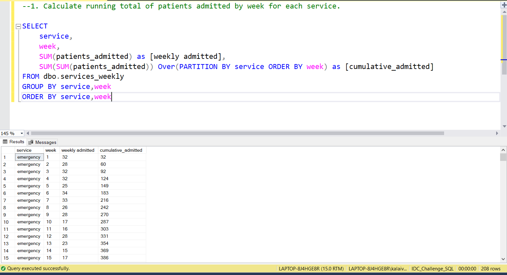
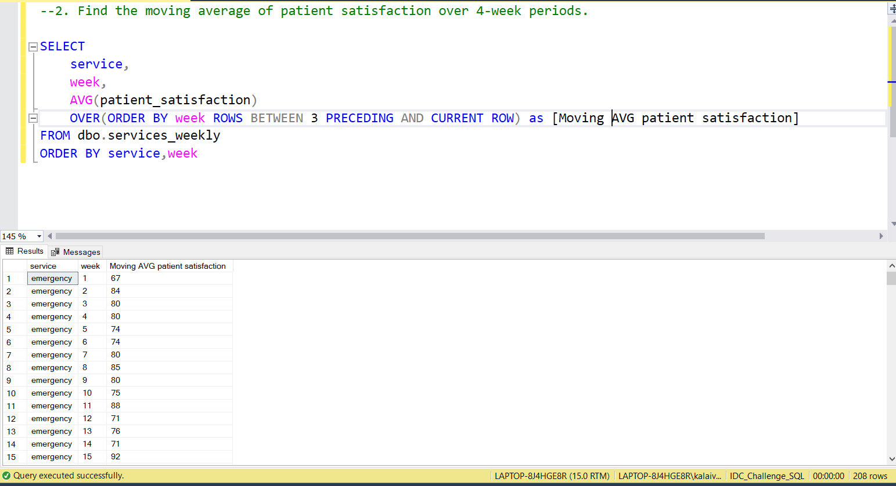
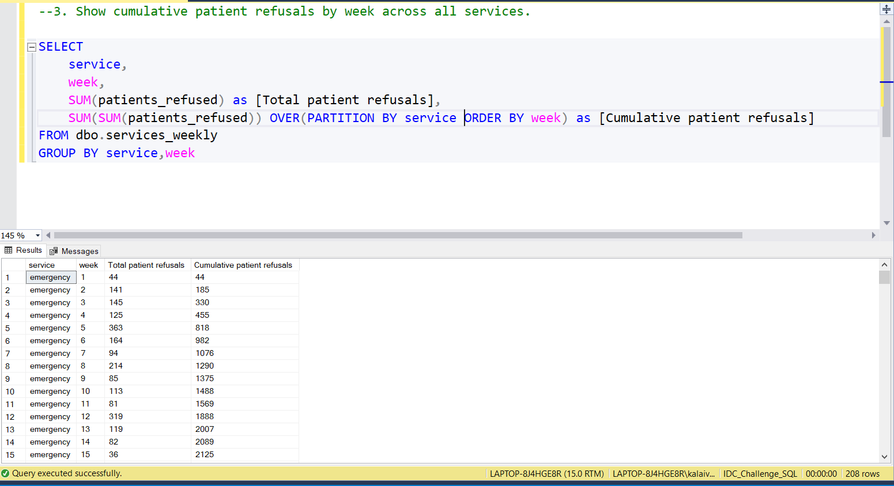
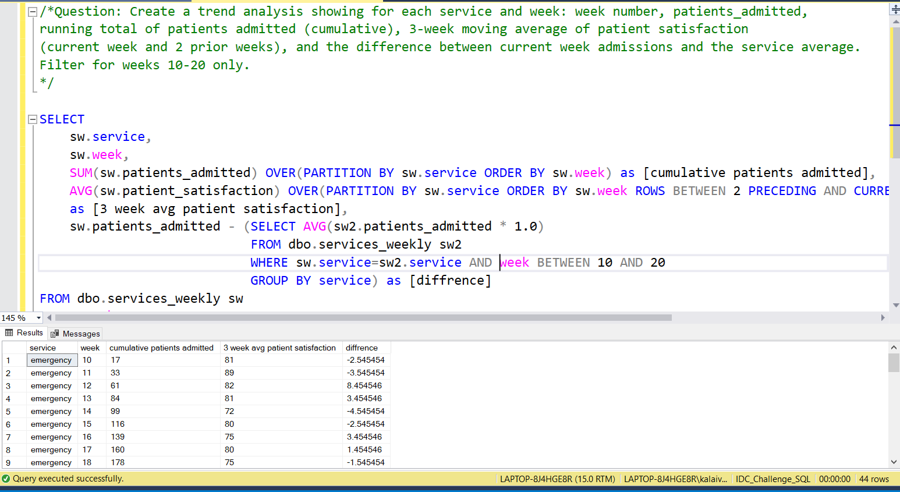

# 📅 Day 20:  Window Functions - Aggregate Window Functions
📆 Date: 26/11  

---

## 🧠 Topics Covered
- SUM() OVER
- AVG() OVER
- running totals
- moving averages

💡 Tips & Tricks

✅ **Frame clause defaults** when using ORDER BY:

```sql
-- This (with ORDER BY):SUM(col) OVER (ORDER BY date)
-- Is actually:SUM(col) OVER (ORDER BY date ROWS BETWEEN UNBOUNDED PRECEDING AND CURRENT ROW)
```

✅ **Without ORDER BY, frame is entire partition**:

```sql
-- Running total (ORDER BY included)SUM(col) OVER (PARTITION BY service ORDER BY week)
-- Overall service total (no ORDER BY)SUM(col) OVER (PARTITION BY service)
```

✅ **Moving averages** use ROWS BETWEEN:

```sql
-- 3-period moving average (current + 2 before)AVG(col) OVER (ORDER BY date ROWS BETWEEN 2 PRECEDING AND CURRENT ROW)
-- Centered 5-period (2 before, current, 2 after)AVG(col) OVER (ORDER BY date ROWS BETWEEN 2 PRECEDING AND 2 FOLLOWING)
```

✅ **Calculate differences from aggregates**:

```sql
-- Deviation from averagecol - AVG(col) OVER (PARTITION BY group)
-- Percentage of total100.0 * col / SUM(col) OVER (PARTITION BY group)
```

### Basic Syntax

```sql
window_function() OVER (
    [PARTITION BY column]
    [ORDER BY column]
)
SUM(column) OVER (...)
```

### Practice Outputs

1. Calculate running total of patients admitted by week for each service.
SELECT
	service,
	week,
	SUM(patients_admitted) as [weekly admitted],
	SUM(SUM(patients_admitted)) Over(PARTITION BY service ORDER BY week) as [cumulative_admitted]
FROM dbo.services_weekly
GROUP BY service,week
ORDER BY service,week



NOTE: Because of data discrepancies, the output is not accurate.

2. Find the moving average of patient satisfaction over 4-week periods.
SELECT
	service,
	week,
	AVG(patient_satisfaction) 
	OVER(ORDER BY week ROWS BETWEEN 3 PRECEDING AND CURRENT ROW) as [Moving AVG patient satisfaction]
FROM dbo.services_weekly
ORDER BY service,week



NOTE: Not Joined based on staff_id Because of data discrepancies, the output is not accurate.

3. Show cumulative patient refusals by week across all services.
SELECT
	service,
	week,
	SUM(patients_refused) as [Total patient refusals],
	SUM(SUM(patients_refused)) OVER(PARTITION BY service ORDER BY week) as [Cumulative patient refusals]
FROM dbo.services_weekly
GROUP BY service,week



NOTE: Because of data discrepancies, the output is not accurate.

### Daily Challenge Outputs

/*Question: Create a trend analysis showing for each service and week: week number, patients_admitted,
running total of patients admitted (cumulative), 3-week moving average of patient satisfaction
(current week and 2 prior weeks), and the difference between current week admissions and the service average.
Filter for weeks 10-20 only.
*/

SELECT
	sw.service,
	sw.week,
	SUM(sw.patients_admitted) OVER(PARTITION BY sw.service ORDER BY sw.week) as [cumulative patients admitted],
	AVG(sw.patient_satisfaction) OVER(PARTITION BY sw.service ORDER BY sw.week ROWS BETWEEN 2 PRECEDING AND CURRENT ROW) as [3 week avg patient satisfaction],
	sw.patients_admitted - (SELECT AVG(sw2.patients_admitted * 1.0)
							FROM dbo.services_weekly sw2 
							WHERE sw.service=sw2.service AND week BETWEEN 10 AND 20
							GROUP BY service) as [diffrence]
FROM dbo.services_weekly sw
WHERE week BETWEEN 10 AND 20
ORDER BY service, week;



NOTE: Because of data discrepancies, the output is not accurate.
