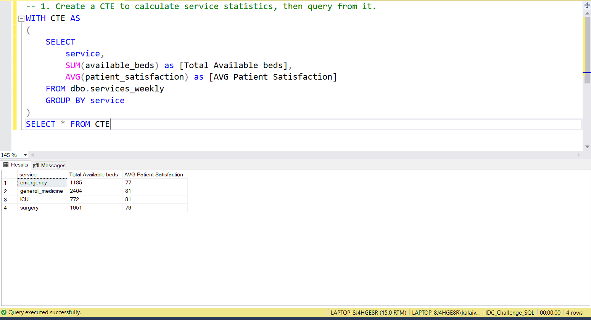
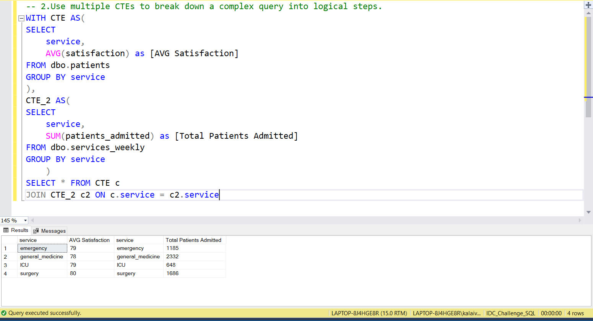
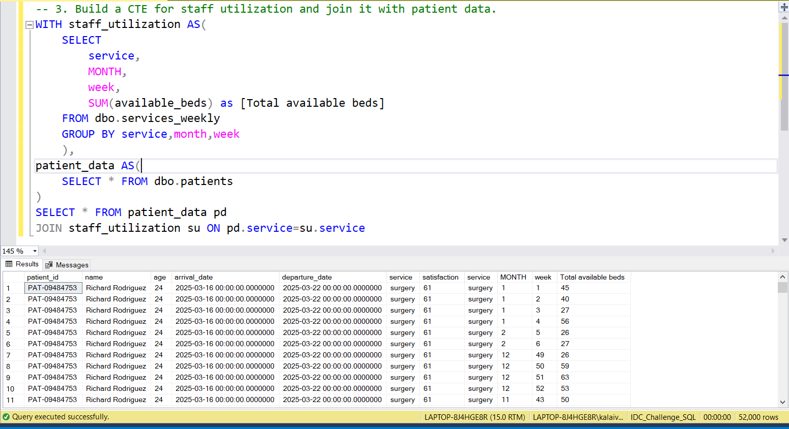
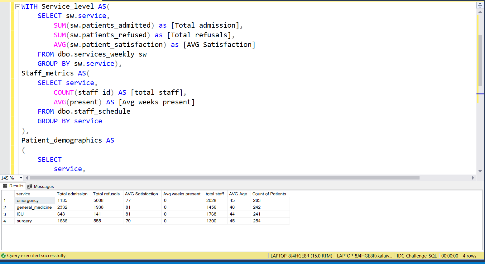

# 📅 Day 21:  Common Table Expressions (CTEs)
📆 Date: 27/11  

---

## 🧠 Topics Covered
- WITH clause
- CTEs
- recursive CTEs (if applicable)
- query organization

💡 Tips & Tricks

✅ **Use CTEs to break down complex queries**:

```sql
-- Instead of nested subqueries, use step-by-step CTEsWITH
step1 AS (SELECT ...),
step2 AS (SELECT ... FROM step1),
step3 AS (SELECT ... FROM step2)
SELECT * FROM step3;
```

✅ **CTEs vs Subqueries**:
- CTEs: More readable, can be referenced multiple times
- Subqueries: More concise for simple cases

```sql
-- CTE (readable, reusable)WITH avg_age AS (SELECT AVG(age) FROM patients)
SELECT * FROM patients, avg_age WHERE age > avg_age;
-- Subquery (more concise)SELECT * FROM patients WHERE age > (SELECT AVG(age) FROM patients);
```

✅ **CTEs are evaluated once** and can be referenced multiple times:

```sql
WITH service_avg AS (
    SELECT service, AVG(satisfaction) AS avg_sat
    FROM patients
    GROUP BY service
)
SELECT *FROM patients p
JOIN service_avg sa ON p.service = sa.service
WHERE p.satisfaction > sa.avg_sat;  -- Reference CTE twice
```

✅ **Use descriptive CTE names** that explain what they contain:

```sql
-- ❌ WITH x AS, y AS, z AS-- ✅ WITH patient_stats AS, staff_summary AS, weekly_trends AS
```

✅ **CTEs improve debugging** - test each CTE independently:

```sql
-- Test first CTEWITH cte1 AS (SELECT ...)
SELECT * FROM cte1;
-- Then add second CTEWITH cte1 AS (...), cte2 AS (...)
SELECT * FROM cte2;
```

✅ **Not materialized by default** - some databases recalculate CTEs each time they’re referenced. Use temp tables for expensive calculations used multiple times.

### Basic Syntax

```sql
WITH
cte1 AS (
    SELECT ...
),
cte2 AS (
    SELECT ...
)
SELECT *FROM cte1
JOIN cte2 ON ...;
```

### Practice Outputs

1. Create a CTE to calculate service statistics, then query from it.
WITH CTE AS
(
	SELECT
		service,
		SUM(available_beds) as [Total Available beds],
		AVG(patient_satisfaction) as [AVG Patient Satisfaction]
	FROM dbo.services_weekly
	GROUP BY service
)
SELECT * FROM CTE



NOTE: Because of data discrepancies, the output is not accurate.

2. Use multiple CTEs to break down a complex query into logical steps.
WITH CTE AS(
SELECT 
	service,
	AVG(satisfaction) as [AVG Satisfaction]
FROM dbo.patients
GROUP BY service
),
CTE_2 AS(
SELECT 
	service,
	SUM(patients_admitted) as [Total Patients Admitted]
FROM dbo.services_weekly
GROUP BY service
	)
SELECT * FROM CTE c
JOIN CTE_2 c2 ON c.service = c2.service



NOTE: Not Joined based on staff_id Because of data discrepancies, the output is not accurate.

3. Build a CTE for staff utilization and join it with patient data.
WITH staff_utilization AS(
	SELECT
		service,
		MONTH,
		week,
		SUM(available_beds) as [Total available beds]
	FROM dbo.services_weekly
	GROUP BY service,month,week
	),
patient_data AS(
	SELECT * FROM dbo.patients
)
SELECT * FROM patient_data pd
JOIN staff_utilization su ON pd.service=su.service



NOTE: Because of data discrepancies, the output is not accurate.

### Daily Challenge Outputs

/*Create a comprehensive hospital performance dashboard using CTEs. Calculate: 
1)Service-level metrics(total admissions, refusals, avg satisfaction),
2)Staff metrics per service (total staff, avg weeks present),
3)Patient demographics per service (avg age, count).
Then combine all three CTEs to create a final report showing service name, all calculated metrics,
and an overall performance score (weighted average of admission rate and satisfaction).
Order by performance score descending.*/

WITH Service_level AS(
	SELECT sw.service,
		SUM(sw.patients_admitted) as [Total admission],
		SUM(sw.patients_refused) as [Total refusals],
		AVG(sw.patient_satisfaction) as [AVG Satisfaction] 
	FROM dbo.services_weekly sw
	GROUP BY sw.service),
Staff_metrics AS(
	SELECT service,
		COUNT(staff_id) AS [total staff],
		AVG(present) AS [Avg weeks present]
	FROM dbo.staff_schedule
	GROUP BY service
),
Patient_demographics AS
(
	SELECT
		service,
		AVG(age) as [AVG Age],
		COUNT(patient_id) as [Count of Patients]
	FROM dbo.patients
	GROUP BY service
)
SELECT 
	sl.*,
	sm.[Avg weeks present],sm.[total staff],
	pd.[AVG Age],pd.[Count of Patients]
FROM Service_level sl
JOIN Staff_metrics sm ON sl.service = sm.service
JOIN Patient_demographics pd ON sl.service = pd.service



NOTE: Because of data discrepancies, the output is not accurate.
